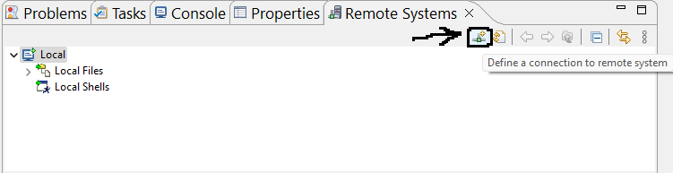
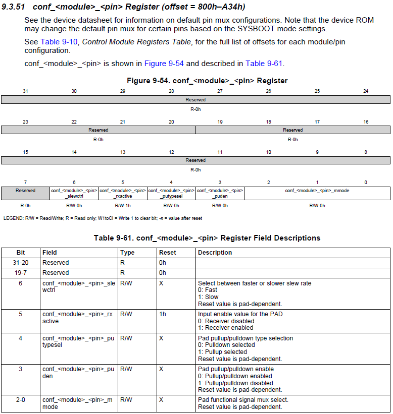
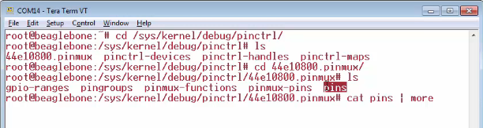
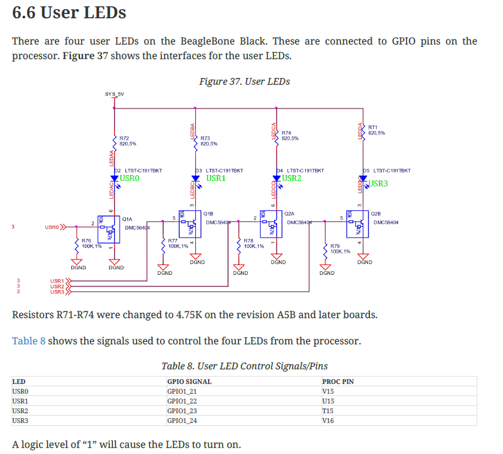
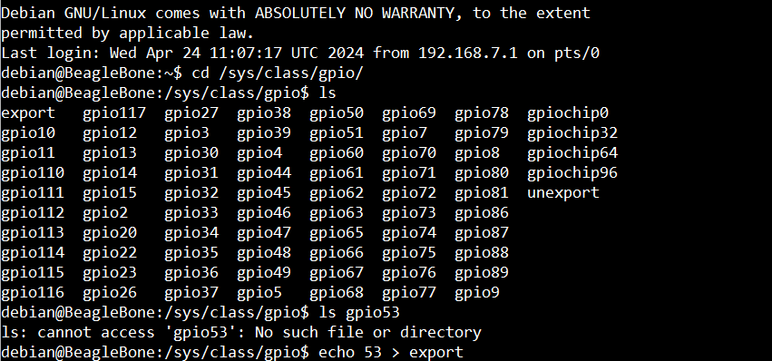
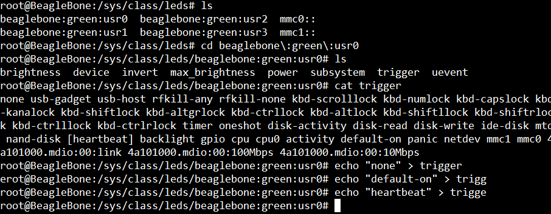

- Run command `$ java -version` in your terminal to see if Java is installed (in this case, it will output the Java version, otherwise error "Command not found") or install Java.   
    
- Download [Eclipse for C/C++](https://www.eclipse.org/downloads/packages/release/2024-03/r/eclipse-ide-cc-developers)      
    
- Download [Linaro toolchain](https://releases.linaro.org/components/toolchain/binaries/), if on **Windows** then choose with following details **gcc-linaro-VERSION-i686-mingw32_arm-linux-gnueabihf.tar.xz**, And extract in the folder (suppose following folder you chose **C:\toolchains\gcc-linaro-7.5.0-2019.12-i686-mingw32_arm-linux-gnueabihf**)    
      
- Download and install [make](https://gnuwin32.sourceforge.net/downlinks/make.php) for Windows      
     
- Now go to Eclipse IDE's **File** > **Project** and click **C/C++** to expand and select **C Project** and click **Next**, Type **Poject name** (i.e. `00_test`) and click **Executable** to expand and choose `Hello World ANSI C Project` and on the next Window **Cross GCC** and click **Next**, Type **Author** your name and leave everything as it is and click **Next**. Go to **Advanced settings**, click **C/C++ Build** to expand and then click **Environment**. There you have to provide the _PATH_ for Linaro toolchain which **;** seperated list (**;C:\toolchains\gcc-linaro-7.5.0-2019.12-i686-mingw32_arm-linux-gnueabihf\bin;**)    
    
You also have to go to the place where **make** for Windows was installed (**GnuWin32** directory) and go into **bin** folder and copy `libiconv2.dll`, `libintl3.dll`, and `make.exe` and paste it into **bin** folder of **gcc-linaro-7.5.0-2019.12-i686-mingw32_arm-linux-gnueabihf**      


**Installing Remote System Explorer and Testing Application**    

Now we have to transfer the binary to the Beaglebone hardware using **Remote System Explorer** (actually an eclipse perspective). It allows you to connect, work with a variety of remote systems.     
     
let's go to **help** and click on **Install new software** and in **Work with:** choose _All Available Sites_ from the dropdown. You will see the Lists appear after sometime. There find and select **Mobile and Device Development** (Under this section among other you will see an entry for _TM Terminal View Remote System Explorer add-in_. Just click **Next** and **Accept the Terms and conditions** when it installed completely, Restart your eclipse.

Now go to **Window** > **Show View** > **Other**, expand the **Remote Systems** and then select **Remote System** and then click on **Open**.    
     
	     
     
Click the button as shown above and select _SSH only_ click Next, leave **Parent profile** as it is, **Host name** as _192.168.7.2_ and connection name _BBB_ click Next twice and then Finish. _Connect your BBB to PC now via the mini USB cable. No need to connect Ethernet cable_
        
Just power on your beaglebone hardware and give the power over the USB cable and when you reset the board, it will boot the debian image from the eMMC memory.(open Tera Term and the serial port before reseting your board)     
      
You can control all these gpios using the sysfs entries `# ls /sys/class/gpio/` you may have to get a root access. When you `ls` the directory `/sys/class/gpio` and also look into **Table 12, SRM page:66**. _Expansion Header P8 pinout_ you will see entirely different naming convention. Here in `/sys/class/gpio` it just uses gpio, it doesn't mention which module it is. 

Expansioon header P8, You get 44 gpios (46 - 2)
Expansion header P9, You get 23 gpios
Total gpios available on the bbb expansion header = 67
**Table 12, SRM page:66** gpio1[6] ==> 1 x 32 + 6  ==>  **/sys/class/gpio/** GPIO38      
gpio0[27]  ==> 0 x 32 + 27 ==> GPIO27   
     
Pad (pin) configuration registers are present at offset 800h (from BASE_ADDRESS `0x44E1_0000` of the control module registers **AM335x Technical Reference Manual page:158** )     
     
	    
      
# Exploring pin details using SYSFS enteries      

We go to sysfs directory to get the details of register (configuration register of control module). Now, go to the `sys/kernel/debug/pinctrl`     
     
	     

Pad configuration registers, `/sys/kernel/debug/pinctrl/44e10800.pinmux`     

You can go to [Spreadsheet](../Docs/Headerpinsmap.xlsx) contains the **pins mapping** get in the output of running (`/sys/kernel/debug/pinctrl/44e10800.pinmux$ cat pin | more`)(which is imaginery software pins numbering) with the pins in [System Reference Manual of Table 12 and 13](../Docs/BBB_SRM.pdf).         
      

# Controlling User LEDs using SYSFS enteries     
       
If you open the **SRM page:52 6.6 User LEDs** these are the user LEDs, which is available on board.        
     
	     
       
The user **LED0** is actually connected to _GPIO module 1 pin number 21_ (GPIO1_21). if you want to convert this to a kernel friendly GPIO number, then:     
     
**GPIO1_21** ==> 1 x 32 + 21 ==> **GPIO53**

`cd` into `# cd /sys/class/gpio` and `ls` at `/sys/class/gpio# ls`, You will find the following enteries, However you will not find any entery for gpio53 (Kernel friendly GPIO number 53 calculated above) by doing `/sys/class/gpio# ls gpio3`.     
     
However you can create the entry by using `/sys/class/gpio# echo 53 > export`. when you press enter, you see it says that _Device or resource is busy_. Reason being is, these GPIO numbers that is GPIO**53** (GPIO1_21), GPIO**54** (GPIO1_22), GPIO**55** (GPIO1_23), and GPIO**56** (GPIO1_24) actually claimed by the user LED driver of the Linux kernel.      
     
	     
        
That LED driver actually creates a separate directory called 'leds' in `/sys/class/leds` and by doing **ls** you will see the 4 enteries for corresponding 4 user LEDs.      
     
	    
      
You can first read the **trigger** and then send command to **trigger** to turn on/of LED etc.      
     
	   

If you run `/sys/class/leds/beaglebone:green:usr0# echo "none" > trigger` and `cat trigger` again you will see **[none]** is now wrapped in square brackets (means currently selected)        
     
```bash
# on for sometime and off for sometime (blinking)
/sys/class/leds/beaglebone:green:usr0# echo "timer" > trigger
```     
      
When you see the on and off paterrn it will be perfect squarewave (equal time for on and off). which you an change by `delay_on` and `delay_off` inside **beaglebone:green:usr0**     

```bash
/sys/class/leds/beaglebone:green:usr0# echo "100" > delay_on
/sys/class/leds/beaglebone:green:usr0# echo "500" > delay_off
```             
    
When you do `cat trigger` you will find following output:     

```bash
root@BeagleBone:/sys/class/leds/beaglebone:green:usr0# cat trigger
none usb-gadget usb-host rfkill-any rfkill-none kbd-scrolllock kbd-numlock kbd-capslock kbd-kanalock kbd-shiftlock kbd-altgrlock kbd-ctrllock kbd-altlock kbd-shiftllock kbd-shiftrlock kbd-ctrlllock kbd-ctrlrlock [timer] oneshot disk-activity disk-read disk-write ide-disk mtd nand-disk heartbeat backlight gpio cpu cpu0 activity default-on panic netdev mmc1 mmc0 4a101000.mdio:00:link 4a101000.mdio:00:100Mbps 4a101000.mdio:00:10Mbps
```          
     
Whenever you access the **external mmc card** (which is connected to 0, i.e. `mmc0`), or the **internal mmc card** (`mmc1`), when you access those memories, You can make led blink.
      
```bash
root@BeagleBone:/sys/class/leds/beaglebone:green:usr0# echo "none" > trigger
root@BeagleBone:/sys/class/leds/beaglebone:green:usr0# echo "mmc1" > trigger
root@BeagleBone:/sys/class/leds/beaglebone:green:usr0# cat trigger
```     
      
`cat trigger` will show mmc1 is selected as **[mmc1]**. Now if you access the internal emmc (i.e. filesystem which is residing in the internel emmc) by going to `/home/debian` and creating a file `touch foobar` and when you write and save it will make the User1 LED blink and also by running `sync` command (which flushes all the data to the file system) you can see that it blinks However runing `sync` again won't blink as It already flushed the data.
     
You can also make the LED blink whenever you access the SD card (connected to mmc0)     


  


