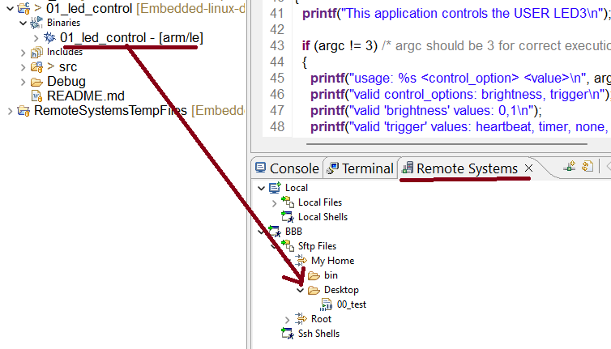

Build the application `01_led_control` and click to **Binaries** section to expand, Now drag and drop `01_led_control` into Remote Systems windows and finally inside `My Home > Desktop` (Make sure your BBB is connected to your PC)      
     

     
	       
      
Now, you can go to **Terminal** section of IDE, log in as root and run following commands as follows:     

```bash
debian@BeagleBone:~$ sudo -s               # or 'sudo su' to login as root
root@BeagleBone:/home/debian# cd Desktop   # or whereever you placed the binaries   
root@BeagleBone:/home/debian/Desktop# chmod +x 01_led_control  

root@BeagleBone:/home/debian/Desktop# ./01_led_control  
This application controls the USER LED3
usage: ./01_led_control <control_option> <value>
valid control_options: brightness, trigger
valid 'brightness' values: 0,1
valid 'trigger' values: heartbeat, timer, none, oneshot, default-on
```           

# How to execute this application?      
       
```bash
root@BeagleBone:/home/debian/Desktop# ./01_led_control trigger heartbeat
root@BeagleBone:/home/debian/Desktop# ./01_led_control trigger oneshot
root@BeagleBone:/home/debian/Desktop# ./01_led_control trigger none

root@BeagleBone:/home/debian/Desktop# ./01_led_control brightness 1
root@BeagleBone:/home/debian/Desktop# ./01_led_control brightness 0
```    
