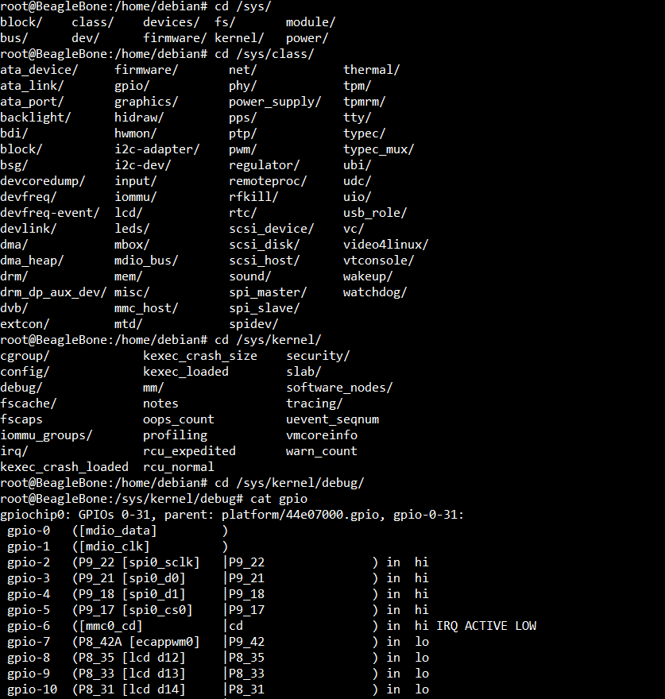
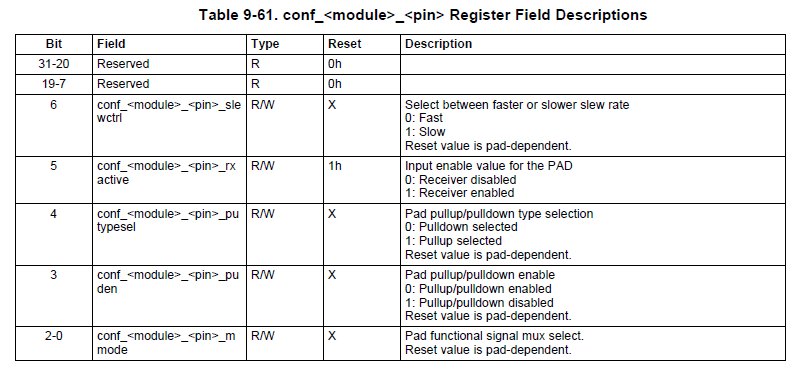
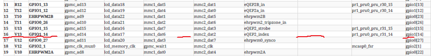
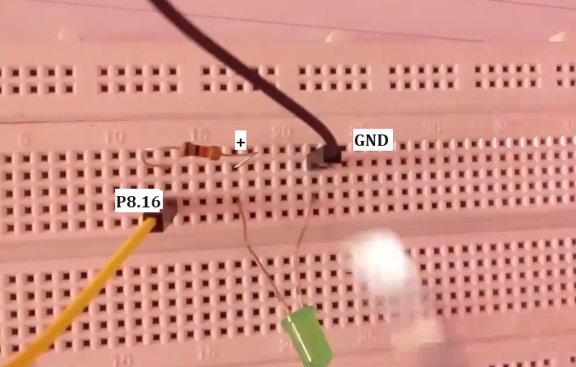

Interfacing an external LED to the expansion header (P8, or P9) of the beaglebone black hardware (through Sysfs directory) There's no other way you can interface something to the beaglebone black hardware except expansion header.     
      
You can use any of the pin as stated on **Table 12/13 Expansion Header P8/P9** of SRM to connect your external LEDs. As every pin can be put into gpio mode, if you configure the mode as MODE7. As you saw previously, the device tree binary (dtb) actually override the default behavior of the pin. so you have to use device tree overlays to reconfigure the mode of a particular pin.     
      
To find the pins of the expansion header which are available as a GPIO pins, go to **sys** directory and `/sys/kernel/debug`.        

      
        
```bash
root@beaglebone:/sys/kernel/debug# cat gpio
gpiochip0: GPIOs 0-31, parent: platform/44e07000.gpio, gpio-0-31:
 gpio-0   ([mdio_data]         )
 gpio-1   ([mdio_clk]          )
 gpio-2   (P9_22 [spi0_sclk]   |P9_22               ) in  hi
 gpio-3   (P9_21 [spi0_d0]     |P9_21               ) in  hi
 gpio-4   (P9_18 [spi0_d1]     |P9_18               ) in  hi
 gpio-5   (P9_17 [spi0_cs0]    |P9_17               ) in  hi
```      

As above, output from `cat gpio` tells you what are the gpios available in the expansion header. it also shows the **P9_22** is available as a **gpio-2**. When you go to Table **Table 13 Expansion Header P9** of SRM , you see its default mode is **UART2_RXD**. However it is set to **gpio0[2]** or **gpio-2** (output of `$ /sys/kernel/debug# cat gpio`) on actual hardware (probably through dtb).     
      
On the other, you can find the kernel pin number corresponde to P9_22 in our [Spreadsheet](../Docs/Headerpinsmap.xlsx) as 84.  
      
```
root@beaglebone:/sys/kernel/debug# cat /sys/kernel/debug/44e10800.pinmux-pinctrl-single/pins
....
pin 84 (PIN84) 2:gpio-0-31 44e10950 00000037 pinctrl-single
pin 85 (PIN85) 3:gpio-0-31 44e10954 00000037 pinctrl-single
pin 86 (PIN86) 4:gpio-0-31 44e10958 00000037 pinctrl-single
pin 87 (PIN87) 5:gpio-0-31 44e1095c 00000037 pinctrl-single
pin 88 (PIN88) 6:gpio-0-31 44e10960 0000002f pinctrl-single
```      
      
You see the pad (or pin) 84's configuration register consist of `00000037` as above. We can interpret it (`37` ==> `0011 0111`) by going to **AM335x TRM Table 9-61. conf_<module>_<pin> Register Field Description**.      
       
_<pin> Register Field Description">     

**P9_22**        
So, `37` ==> `0011 0111`, according to above table, 111 (**bit 2-0** Gpio mode), 0 (**bit 3** pullup/down enabled), 1 (**bit 4** pullup selected), 1 (**bit 5** input enabled), 0 (**bit 6** slew rate slow)     
       
> [!NOTE]     
>  **root@beaglebone:/sys/kernel/debug/ cat gpio** list out all the available gpios.    
>  gpio-44  (P8_12               |P8_12              ) in  lo      
>  gpio-45  (P8_11               |P8_11              ) in  lo       
>  gpio-46  (P8_16               |P8_16              ) in  lo      
>  gpio-47  (P8_15               |P8_15              ) in  lo      
>  gpio-48  (P9_15A              |P9_15              ) in  hi

Another example, let's say P8_16 pin which is available for you as a gpio-46. That you can confirm by going to the **Table 12 Expansion Header P8 Pinout in SRM** and it's default behaviour is GPIO1_14 as show below.   

          
        
And **GPIO1_14** (gpio1[14]) is equal to 1 x 32 + 14 ==> **GPIO46**, On the other hand according to our [document](../Docs/Headerpinsmap.xlsx) P8_16 is actually the **pin number 14**. Alternatively you can do the **cat /sys/kernel/debug/pinctrl/44e10800.pinmux-pinctrl-single/pins** and the output contain all the pins (PIN0 to PIN141) and PIN14 entry will look like `pin 14 (PIN14) 14:gpio-32-63 44e10838 00000027 pinctrl-single`     
According to **AM335x TRM Table 9-61. conf_<module>_<pin> Register Field Description** above you can interpret it as follows:      

**P8_16, GPIO46**         
`27` ==> `0010 0111`, according to above table, 111 (**bit 2-0** Gpio mode), 0 (**bit 3** pullup/down enabled), 0 (**bit 4** pull down selected), 1 (**bit 5** input enabled), 0 (**bit 6** slew rate slow)

We will now connect one external LED to one of the GPIOs (P8_16 pin is selected for this purpose, which is positive terminal and 6-8mA of current will flow, one resistor of 330 OHM is needed), Other side GND (P9_1 or P9_2)      

     
     
As we know that the GPIO P8_16 is actually GPIO1[14] that is 46. Now we have to control the GPIO46 to control the LED which is connected to that. `/sys/class/gpio# ls` is the place to control various gpios. Now **cd** into **gpio46** and do the following:     
      
```bash
root@BeagleBone:~# cd /sys/class/gpio
root@BeagleBone:/sys/class/gpio# ls
export   gpio117  gpio27  gpio38  gpio50  gpio69  gpio78  gpiochip0
gpio10   gpio12   gpio3   gpio39  gpio51  gpio7   gpio79  gpiochip32
gpio11   gpio13   gpio30  gpio4   gpio60  gpio70  gpio8   gpiochip64
gpio110  gpio14   gpio31  gpio44  gpio61  gpio71  gpio80  gpiochip96
gpio111  gpio15   gpio32  gpio45  gpio62  gpio72  gpio81  unexport
gpio112  gpio2    gpio33  gpio46  gpio63  gpio73  gpio86
gpio113  gpio20   gpio34  gpio47  gpio65  gpio74  gpio87
gpio114  gpio22   gpio35  gpio48  gpio66  gpio75  gpio88
gpio115  gpio23   gpio36  gpio49  gpio67  gpio76  gpio89
gpio116  gpio26   gpio37  gpio5   gpio68  gpio77  gpio9
root@BeagleBone:/sys/class/gpio# cd gpio46
root@BeagleBone:/sys/class/gpio/gpio46# ls
active_low  device  direction  edge  label  power  subsystem  uevent  value
root@BeagleBone:/sys/class/gpio/gpio46#
```        
      
If **gpio46** is not present then you can do `root@BeagleBone:/sys/class/gpio# echo 46 > export` to create entry for gpio46. You can do `active_low`, `edge`, `direction` and various other commands as given above to configure that particular gpio pin. running `root@BeagleBone:/sys/class/gpio/gpio46# cat direction` will output **in** which we already decoded above as GPIO46 is in input mode.     
**P8_16 (GPIO46)**     
27 ==> 0010 0111 ==> GPIO MODE + PULL DOWN SELECTED + INPUT MODE     
       
As we are driving the LED. Hence it supposed to be in Output mode which can be changed by running `root@BeagleBone:/sys/class/gpio/gpio46# echo "out" > direction` and you confirm it output as **out** by running `cat direction`     
     
## LED Turn ON/OFF     

```bash
root@BeagleBone:/sys/class/gpio/gpio46# echo 1 > value      # turn ON 
root@BeagleBone:/sys/class/gpio/gpio46# echo 0 > value      # turn OFF

root@BeagleBone:/sys/class/gpio/gpio46# cat active_low
0
root@BeagleBone:/sys/class/gpio/gpio46# echo 1 > active_low # now logic changed 

root@BeagleBone:/sys/class/gpio/gpio46# echo 1 > value      # turn OFF 
root@BeagleBone:/sys/class/gpio/gpio46# echo 0 > value      # turn ON
```     
      
Now you can also try with buttons (read them the button status) by making gpio as a input.  And you can read the status of button by querying `root@BeagleBone:/sys/class/gpio/gpio46# cat value`