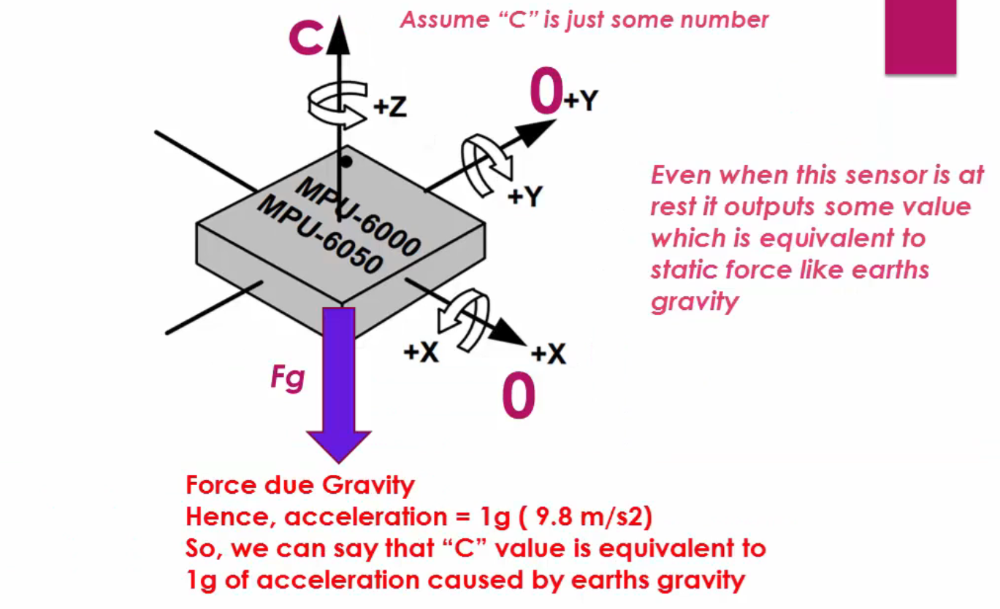
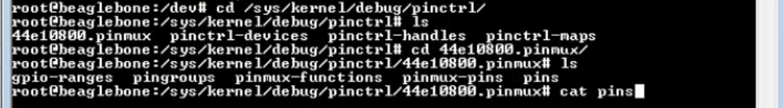
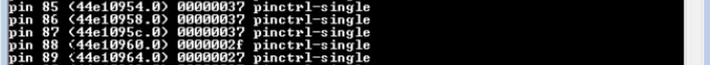

## Accelerometers     
     
> Accelerometer is a sensor, which can measure the Accelerational forces, which are acted on it (or vibrational forces from various directions). The micro crystals inside the sensor will produce readings directly proportional to the forces exerted on all 3 axis of the sensor. As **force** is directly propotional to the **acceleration** . Hence, when the force increases the acceleration increases and vice versa.     
     
Assume, you have a sensor which is quietly sitting on the table (completely at rest with no vibrations at all). We cna conclude no force acting on the sensor, on other word no readings from this sensor. Therefore the readings from all the 3 axes (X, Y, and Z) should 0s. However that's not true as there are no dynamic forces acting upon it i.e. vibrations etc, One the other hand, there is still an influence of static force acting on it which is Earth's gravity and it is acting perpendicular to the sensor.     
      
     
     
Hence, we can assume if the value of **C** is 2048 (sensor outputs the value 2048) then there is an acceleration of 1g. Alternatively when you shake the table. Thee vibrational forces acting on all the 3 axis of the sensor and you will start seeing the readings coming out from all 3 axis of the sensor. which means the sensor produces the output which is directly proportional to the forces acting on it (Force _directly propotional_ acceleration).

Using these concepts, you can use to develop some interesting applications. For example you hold the sensor in your hand and run. It exert vibrations from the sensor and the sensor will start emitting readings across all 3 axis. Let's say you run for 10 seconds. And if you want to calculate what was the acceleration at 5th second, then you take the readings of X Y Z coordinate at 5th second convert them into g values. (The datasheet always tell us what is the reading at 1g of acceleration, based on that we can convert any raw readings from the sensor to its equivalent "g" values)    
      
     
      
As running is in the x-direction. Hence we get the acceleration for x-direction.     
     
Accelerometer also being used in the "Tilt" sensing application in your mobile phones and in gaming applications.       
      
     
      
The accelerometer also can be used in tilt sensing application by taking earth's gravitational acceleration as a reference. When you tilt the object on the x-axis to make an angle of 45 degrees with the surface (The X-axis which was parallel before is no longer parallel now and experiences the earth's gravitational pull). When you take the readings on all 3 axis, you should be seeing 1024 on the X-axis, 0 on the Y- axis, and 1024 on the Z-axis. As the acceleration due to earth's gravity is 1g, which is now split into 2. That is X-axis will experience 0.5g of acceleration and Z- axis will experience 0.5g of acceleration. Change in X- axis reading we can conclude the body is tilted at X-axis by the **angle** which can be find out by this formula     
      
     
      
**Accelerometer applications**     

Tilting angle of the object can be used in lots of applications like:   
* changing your mobile phones orientation from portrait to landscape      
* in gaming applications     
* to monitor the health of the buildings, bridges, etc. (structural health monitoring) 
* in medical electronics, smart watches etc.    
     
## Gyroscope     
As accelerometer measures the Acceleration forces exerted on the X Y Z axes, Similarly Gyro measures the **rotational movement** of an object over the X Y Z axes.      
      
    

As above image illustrate, if we keep the **gyroscope** in our hand and start running on the x axis, then the gyro ideally should not show any readings over the x axis unlike the accelerometer. On the other hand, if it is **accelerometer** instead of gyroscope then we should see some readings coming out from the sensor across the X-axis.     
      
In the case of an object which is rotating on a given axis then the gyro will output rotational speed on that axis. That means, how fast the object is rotating is measured in **degree per second** (i.e. object may be rotating at 5 deg/sec).    
      
Similar to Accelerometer, if Gyro is sitting static on a table, then there is no rotational moment across any of these axes. Hence, you should be seeing 000 in all 3 axis.

To figure out as when to use a accelerometer and when to use gyroscope?? let's take an example of 3 dimensional movement of an airplane. There are 3 types of movements of the plane roll, pitch, and yaw.     
      
    
          
      
    
          
      
      
      

# MPU-6000/MPU-6050     

The MPU6050 sensor is actually produced by a company called InvenSense And they have wide ranges of motion tracking sensors. One among these is MPU6050 which is a single sensor, consisting of both gyroscope as well as accelerometer sensor on a same IC.    
    
MPU6050 sensor communicates with your microcontroller over I2C communication.

You cannot use SPI here. Because, MPU6050 doesn't support SPI. However there are some other MPU6 cross series which can support SPI communication. You can get to know more about the sensor by visiting two documents, [Product specification (Datasheet)](../Docs/MPU-6000-Datasheet1.pdf) and the [Register sets](../Docs/MPU-6000-Register-Map1.pdf) of the MPU6050 sensor.     
     
Next, we gather some of the specifications of the sensors by referring to the Product specification thereby we will first look for the slave address (Section _9 DIGITAL INTERFACE page: 33_).    
      
> The slave address of the MPU-60X0 is b110100X which is 7 bits long. The LSB bit of the 7 bit address is determined by the logic level on pin AD0. This allows two MPU-60X0s to be connected to the same I2C bus. When used in this configuration, the address of the one of the devices should be b110100 **0x68** (pin AD0 is **logic low**) and the address of the other should be b1101001 **0x69** (pin AD0 is **logic high**).      
      
**In the breakout board, AD0 is grounded. Hence the default slave address of the I2C of this sensor will be 0x68.**    
      
If you wish to connect 2 sensors, then you have to change the address of the one sensor by connecting AD0 pin of one of the sensor to high voltage.     

## Understanding MPU6050 Accelerometer Full Scale Range              

Every accelerometer sensor, no matter which vendors it comes from, provide the accelerometer sensitivity numbers. Thats how you can tune accelerometer's sensitivity (**Full scale ranges**) in different applications of yours.   

      
      
Sensitivity can be vary by choosing different kinds of full scale ranges of the accelerometer sensor. And this accelerometer offers us 4 different _Full Scale Ranges_ (AFS_SEL=0 to AFS_SEL=3). That means, if you select **AFS_SEL=0** Full Scale Range, then the sensor can measure up to plus or minus 2g of acceleration. In case of operating your application in high impact and high vibrations then you should not keep your accelerometer to this range as it can only go from 0 to plus or minus 2g according to table above (it can only measure the g values within 2). For example, you have an application where you want to measure a slight vibration or very slight angle tilt etc. Then it is better to choose a full scale range as small as possible to get better resolution. Alternatively if you choose this sensor for very dynamic system like rockets or quadcopters or in the aircraft systems etc then the system produces lots of vibrations and you should expect more g values there.     
      
For example, if you select **AFS_SEL=3** then the accelerometer can give the acceleration g values up to 16g. Off course, you will lose the sensitivity here (as application will not be sensitive to small vibrations or small angle tilt etc.)

Let's say I program my accelerometer to operate in the full scale range **AFS_SEL=0** which means it can read up to 0 to plus or minus 2g. Now, above table also says that the **output is in 2's complement format** of type 16 bits.     
     
**16 = 1 + 215 = +/- 32768**, here 1 bit is used to indicate the sign and 15 bits are left for data. Hence 32,768 is the maximum reading that can be produced by the sensor.      
And this table also says that, if you are operating in the Full Scale Option 0 (AFS_SEL=0), then the output will be 16,384 for every g. And for 1g 32,768/2 = 16,384 (for every g of the acceleration, the ouput produced is 16,384)     
     
Let's say if we select the Full Scale Range as 3 (AFS_SEL=3) then the output can go from 0 to +/- 16g. Hence, according to the table, 2048 is the reading for every g. And if you take 2048 and multiply by 16, you get the higher bound value 32768.    
     
Assume, our sensor is lying on the table and sensor is completely at rest on the table. As we know, there will be one force which will be acting on the sensor, that is the gravity  (9.8 m/s2 which we consider as 1g). Now let's say the sensor is in the full scale range AFS_SEL=3. Therefore if we measure the reading at Z-axis by connecting MPU to a microcontroller then it should be around 2048. As per the document the g value is 2048. On the other hand X-axis and Y-axis must be 0.

      
      
        
**Converting raw accelerometer value into g vlaues**    

Assume we have 3 axis (X, Y, and Z) and raw value 6000 and let's assume this is of Z-axis. So to convert it to g value we must know the Full Scale Range of the sensor in which it is operating.       

      
      
In the full scale 0 (AFS_SEL=0), the value will be 16,384 for every g. We divide the 6000/16,384 and we get 0.36g
In the full scale 2 (AFS_SEL=2), the value will be 4096 for every g. We divide the 6000/4,096 and we get 1.4g      
        
## Understanding MPU6050 Gyroscope Full Scale Range           

Similar to Accelerometer, the gyroscope sensor also has a 4 choices to select the Full Scale Range.      

      
     
If you select the Full Scale Range 0 (FS_SEL=0), then the maximum it can measure is 250 degree of rotation per second. Similarly the output is 16 bits and only 15 bits are used to indicate the data.   
      
This table also says that (FS_SEL=0 type 131), when in the full scale mode 0 for every degree of rotation per second, you will get the reading of 131. Hence 131 is the raw value which is given by your sensor for every degree change in rotation.      
       
## MPU6050 breakout board details     

Here's the schematic of MPU6050 from [Adafruit](https://www.adafruit.com/product/3886). However you can use any cheap similar MPU over the internet which may have slightly different specification. As other MPUs has pullup resistor attached to them with value of 4.7k ohm whereas Adafruit MPU has resistor value of 10K ohm.      

      

This MPU doesnt come with magentometer. if you need to attach any such sensor you can connect it directly to MPU6050 through XCL or XDA pin (also knows as SCL_EXT and SDA_EXT) as shown in the schematic. And the INT pin is used to interrupt your microcontroller from this sensors. In low power communication,  whenever the controller goes to sleep this MPU6050 can use this interrupt pin to wake up the microcontroller to ask it to fetch the data from the sensor. Hence the microcontroller is allowed to sleep whenever the sensor is doing some operation and when the  sensor completes its operation it interrupts the processor and wakes the processor up.    
     
         
     
         
      
        
## Deciding BBB I2C pins for sensor interfacing      

Let's understand, how we can talk to the I2C engine of the AM335x SOC by using our application (as MPU6050 actually communicates through the I2C interface). You can go to [Technical reference manual](../Docs/TRM_AM335x_techincal_reference_manual.pdf) under section I2C and _21.2 Intergration_ **page 3700**, it says that  AM335x device includes 3 instantiations of the I2C module. Which you can confirm by loging into BBB.    
      
       
      
You can see above output the _dev_, i2c-0, i2c-1, and i2c-2 are the software representations of these engines present in the AM335x SOC. These interfaces (in _dev_ folder) are actually enumerated by the omap I2C driver present in the kerne (when configure and generate linux image by giving `omap2plus_defconfig` flag as `linux$ make ARCH=arm CROSS_COMPILE=arm-linux-gnueabihf- bb.org_defconfig`).    
     
When you go to BBB's System Reference Manual under _Table 13. Expansion Header P9 Pinout_. Here, you see the pin number **17** and **18** of the expansion header P9 are meant for **I2C1** controller only when you program them into MODE2 (changing it's mode using device tree overlays or by some other means). Similarly, the **19** and **20** cannot be used as **I2C2** pins unless you change its mode to MODE3.     
     
> [!NOTE]    
> First you have to verify Whether there mode is for I2C or not by taking the help of SYS_FS pin control location. Now, visit [Document](../Docs/Headerpinsmap.xlsx) of Header pins map which maps your expansion header pin to software pin number. There you will find P9_17 and P9_18 are 87 and 86 as software pins.     
     
Now go to SYS FS directory under the kernel, debug, pin control `/sys/kernel/debug/pinctrl/44e10800.pinmux/`.     
     
       

Search for 87 and 86 which has value 0000003**7** indicates the last 3 bits are actually 7. We can conclude that pin 17 is not in the I2C mode, on the other hand, it is in gpio (correspond to MODE7)    
     
     
      
Now, we try our luck for P9_19 and P9_20 which correspond to software pins 95 and 94 according to expansion header mapping [Document](../Docs/Headerpinsmap.xlsx). We again run `/sys/kernel/debug/pinctrl/44e10800.pinmux/cat pins` to see the last 3 bits (0000003**3**) and which has value 3, means it is already on MODE3 in which **P9_19** and **P9_20** behaves as I2C2      
      
      
## Pin out         
         
| BBB Expansion header (p9) pins | MPU6050 pins |
|:------|------:|
| P9_19 | SCL |
| P9_20 | SDA |
| P9_3  | VCC (3.3 or 5v) |
| P9_1  | GND |                 
       
**Datasheet references**       
1. Consult Expansion header (p9) [Table 13, page : 68](../Docs/BBB_SRM.pdf) info on VCC, GND, and  I2C2 pins
2. MPU-6000 and MPU_6050 [Product Speicification Revision 3.3](../Docs/MPU-6000-Datasheet1.pdf)    
3. MPU-6000 and MPU_6050 [Register Map and Description Revision 4.2](../Docs/MPU-6000-Register-Map1.pdf)      

