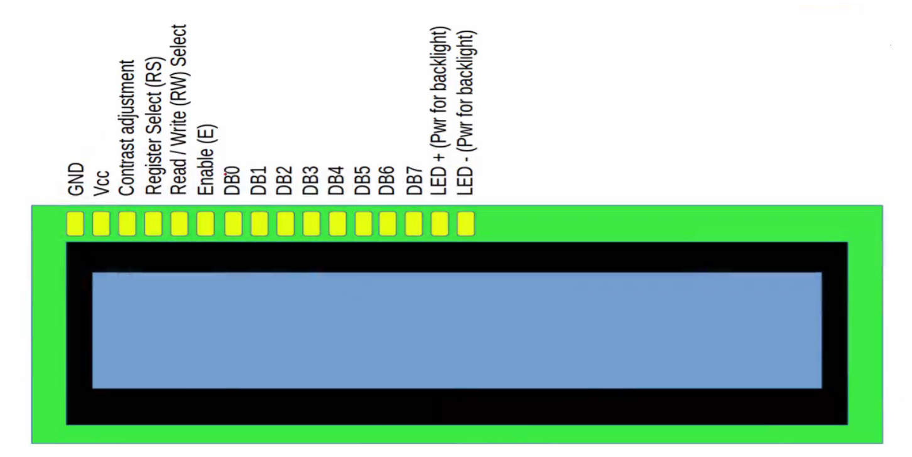

In this project, We interface 16x2 character LCD display to our beaglebone black hardware. This LCD models come with inbuilt LCD controllers and use it to print alphanumeric characters and various commonly used symbols on the liquid crystal display.    
     
We will be using:     

1. Beaglebone hardware    
2. 16x2 LCD display    
3. Connecting wired, male to male    
4. Breadboard    
5. Potentiometer 100K OHM 0r 10K OHM          
     

# 16x2 LCD pin details    

This LCD display consists of 16 pins on the panel.      
     
      

You can connect 5v to **Vcc** and **LED+** (Power of backlight) pin and Ground to **GND** and **LED-**

**DB0** to **DB7** are actually used to transfer 8 bits of data in parallel. Let's say, you want to transfer the character A, to this LCD panel to display it. The ASCII value of `A` is `0x41` that corresponds to `01000001` in binaries. When you transfer all these 8 bits `01000001` onto DB0 to DB7 lines the LCD will display the character A.      
      
However, sometimes the microcontroller may not have 8 free pins, in that case you can also use 4 bits (D4 to D7) of data transfer (4 bit data transfer mode). And you need not to use pins from DB0 to DB3. Therefore we divide this data `0100 0001` transfer that is 8 bit data transfer into 2. The first nibble (higher order bits) `0100` and later we send second nubble `0001`.     
    
Data can be 2 types which includes printing tags, special characters, numbers etc. However, data can also be a LCD command like cursor off, on, text shift, and blink etc.     
      
There are another 4 important pins like Contrast adjustment, Register select, Read/Write, and Enable. These pins are actually used as a LCD control.

**Contrast adjustment** pin you have to connect it to the potentiometer to change the resistance thereby changing the voltage supply at this pin.       
      
**Register Select (RS)** when 0 then LCD controller come to know that data on the lines (DB0 to DB8) is actually a LCD command. Hence it transfer it into IR (Instruction Register) And if RS=1 then the LCD controller will take this data on lines as User data not a LCD command. Ultimately transfer it into DR (Data Register)       
      
**Read/Write (RW)** 0 means the LCD controller will think that the user is writing into the LCD (i.e. writing commands or user data). And if RW=1 then the LCD controller will think that user wants to read from the LCD (read the RAM contents, busy status, or address counter value which basically hold the address of internal RAM of LCD controller).      
       
**Enable (E)** pin actually used to instruct your LCD controller to latch the data.      
      
Let's say, I want to transfer the letter `A`. I would make **Register select** as 1 (as we are dealing with the user data not LCD command), **Read/Write (RW)** pin as 0 (as we are transferring/writing the data to the LCD). Next we place the bits onto pins DB0 to DB7 (If it is a 8 bit transfer). However placing the data on to line DB0 to DB7, doesn't mean we are transfering it into the data register of the LCD controller. It only means the data is just present on those pins. So, to make the LCD controller latch those data into the _Instruction Register_ or into the _Data Register_. We have to use this **Enable (E)** pin (you have to make high to low transition on the Enable pin).         

# HD44780 LCD controller Internal details            
     
There are lots of LCD modules available in the market. There you have to know what exactly the LCD controller is used in that LCD module by refering to the user manual of your LCD module.

Often it may be HD44780 LCD controller from HITACHI. You can take a look at a block diagram of the LCD controller. (page: 3)      
      
LCD controller often have 2 registers, _Instructions register_ which is connected to instruction decoder And second one is _Data register_ which is actually connected to the DDRAM (Display Data RAM) of this controller. Any data you send, it will either go to the _Instructions register_ or to the _Data register_ depending upon the value of the Register Select (RS) pin.

   

