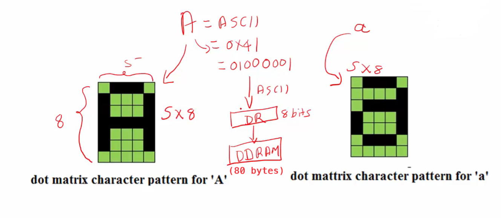

In this project, We interface 16x2 character LCD display to our beaglebone black hardware. This LCD models come with inbuilt LCD controllers and use it to print alphanumeric characters and various commonly used symbols on the liquid crystal display.    
     
We will be using:     

1. Beaglebone hardware    
2. 16x2 LCD display    
3. Connecting wired, male to male    
4. Breadboard    
5. Potentiometer 100K OHM 0r 10K OHM          
     

# 16x2 LCD pin details    

This LCD display consists of 16 pins on the panel.      
     
      

You can connect 5v to **Vcc** and **LED+** (Power of backlight) pin and Ground to **GND** and **LED-**

**DB0** to **DB7** are actually used to transfer 8 bits of data in parallel. Let's say, you want to transfer the character A, to this LCD panel to display it. The ASCII value of `A` is `0x41` that corresponds to `01000001` in binaries. When you transfer all these 8 bits `01000001` onto DB0 to DB7 lines the LCD will display the character A.      
      
However, sometimes the microcontroller may not have 8 free pins, in that case you can also use 4 bits (D4 to D7) of data transfer (4 bit data transfer mode). And you need not to use pins from DB0 to DB3. Therefore we divide this data `0100 0001` transfer that is 8 bit data transfer into 2. The first nibble (higher order bits) `0100` and later we send second nubble `0001`.     
    
Data can be 2 types which includes printing tags, special characters, numbers etc. However, data can also be a LCD command like cursor off, on, text shift, and blink etc.     
      
There are another 4 important pins like Contrast adjustment, Register select, Read/Write, and Enable. These pins are actually used as a LCD control.

**Contrast adjustment** pin you have to connect it to the potentiometer to change the resistance thereby changing the voltage supply at this pin.       
      
**Register Select (RS)** when 0 then LCD controller come to know that data on the lines (DB0 to DB8) is actually a LCD command. Hence it transfer it into IR (Instruction Register) And if RS=1 then the LCD controller will take this data on lines as User data not a LCD command. Ultimately transfer it into DR (Data Register)       
      
**Read/Write (RW)** 0 means the LCD controller will think that the user is writing into the LCD (i.e. writing commands or user data). And if RW=1 then the LCD controller will think that user wants to read from the LCD (read the RAM contents, busy status, or address counter value which basically hold the address of internal RAM of LCD controller).      
       
**Enable (E)** pin actually used to instruct your LCD controller to latch the data.      
      
Let's say, I want to transfer the letter `A`. I would make **Register select** as 1 (as we are dealing with the user data not LCD command), **Read/Write (RW)** pin as 0 (as we are transferring/writing the data to the LCD). Next we place the bits onto pins DB0 to DB7 (If it is a 8 bit transfer). However placing the data on to line DB0 to DB7, doesn't mean we are transfering it into the data register of the LCD controller. It only means the data is just present on those pins. So, to make the LCD controller latch those data into the _Instruction Register_ or into the _Data Register_. We have to use this **Enable (E)** pin (you have to make high to low transition on the Enable pin).         

# HD44780 LCD controller Internal details            
     
There are lots of LCD modules available in the market. There you have to know what exactly the LCD controller is used in that LCD module by refering to the user manual of your LCD module.

Often it may be HD44780 LCD controller from HITACHI. You can take a look at a [block diagram](../Docs/HD44780_LCD.pdf) of the LCD controller (page: 3).      
      
LCD controller often have 2 registers, _Instructions register_ which is connected to instruction decoder And second one is _Data register_ which is actually connected to the DDRAM (Display Data RAM) of this controller. Any data you send, it will either go to the _Instructions register_ or to the _Data register_ depending upon the value of the Register Select (RS) pin.    
      
Another important aspect of this controller is random access memory. There are 2 Random access memories. One is called _Display Data RAM (DDRAM)_ which stores all your data which you send from your microcontroller And another one is _CGRAM (Character Generator RAM)_ which is there to hold custom patterns for your custom characters. And this controller also has a _Character Generator ROM (CGROM)_. And there are lots of decode circuitry, shift registers (to shift your text or character, or to blink your character etc..)      
      
     

# Understanding DDRAM, CGRAM, CGROM        
      
There are 3 memories which are present on the LCD controller, _Display Data RAM (DDRAM)_, _Character Generator ROM (CGROM)_ and _Character Generator ROM (CGROM)_     
     
      
     
Let's understand why DDRAM, CGRAM, and CGROM is used with an example. Assume you want to display character `A` on your LCD which has the dot matrix format of 5x8 (there are 5 columns and 8 rows). However you can change the format 5x8 by sending a suitable command for the LCD. The A is displayed something like this (as shown below). That means each small square box here represents a pixel and only the required pixels are made dark.     
      
    

Remember you dont send these patterns from the microcontroller, rather you send the ASCII equivalent which is 0x41. Basically we send its binary form `01000001` to the LCD. Ultimately it will be captured in the Data Register (DR). As there is only one Data Register with 8 bits wide. Hence the contents will moved to **DDRAM** from the Data Register to make room for any other character which LCD takes from the microcontroller.   
     
As per the datasheet, we have 80 bytes of space in the DDRAM (we can save 80 characters). For this purpose, DDRAM is actually used to store the user's data one by one. As it's base address starts from `0x00` where the first character is stored. And when you send another character. Its address counter will be incremented. Similarly the next character is stored at `0x01` address, the third character at `0x03` all the way up to `0x4F` which is the last address to save 80th character.   
     
Let's say, I have to store one ASCII character that is equivalent to `0x41` (charachter `A`). Now the question is how this value (`0x41`) is converted into the pattern which shows A on the LCD. So, that is actually done by **CGROM**. What happens is the LCD controller then consult the CGROM to find out a suitable pattern for the character `A`. So, all these things happens at the hardware level. **Hence, CGROM contains all the patterns for all the standard ASCII or special character**. Now the answer is still unclear as how this pattern is stored in the CGROM. Because, after all CGROM is also some kind of memory device and, only thing is you cannot write into it, but you can read from it.      
      
So, what LCD controller manufacturer does is, during taping out of the chip. They will write all these standard patterns into the CGROM and they will shift. These patterns are actually encoded into series of bytes. As shown below, each row can be converted into its binary format or hex format. You can add all the pixels which are dark. For example 8+4+2 = `E` correspond to first row and so on.       
      
        
      
So, when you send A, the controller will fetch {0x0E, 0x11, 0x1F, 0x11, 0x11, 0x00} values (8 bytes) from the CGROM, which is actually programmed into the CGROM during the taping out of the chip. Ultimately these values will be decoded to light up the appropriate pixels on the LCD panels. That's how, you get the character A displayed on the LCD. So, CGROM has support for all the ASCII characters, chinese as well as Japanese characters and some special characters which you can determine from going through the [Datasheet](../Docs/HD44780_LCD.pdf) of the controller.     
        
In case, it doesn't support any special characters if you are looking for (As CGROM doesn't contain the pattern for this). Let's say you want to display the ♥︎ heart symbol. You will first find out what are all the pixels you need to activate to get the heart symbol then I will convert that into series of bytes just as you seen for character `A` like {0x0E, 0x11, 0x1F, 0x11, 0x11, 0x00}. You then write those values into **CGRAM**. As we cannot write into CGROM which is read only memory.

   

