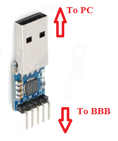
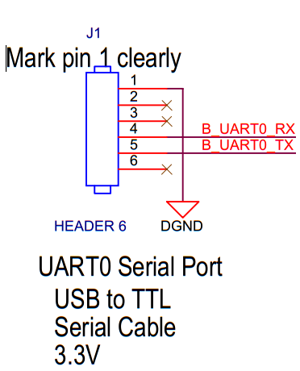
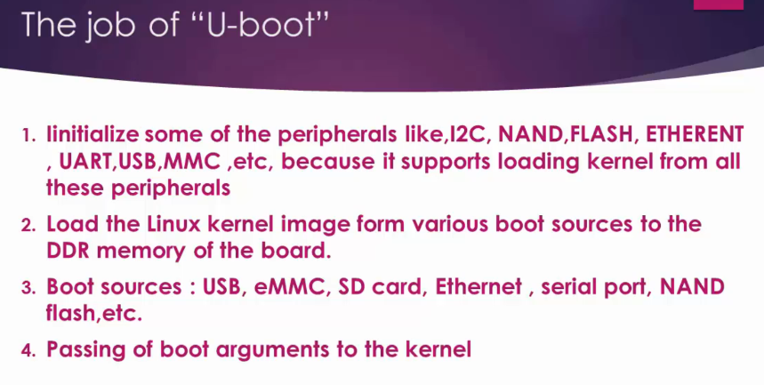
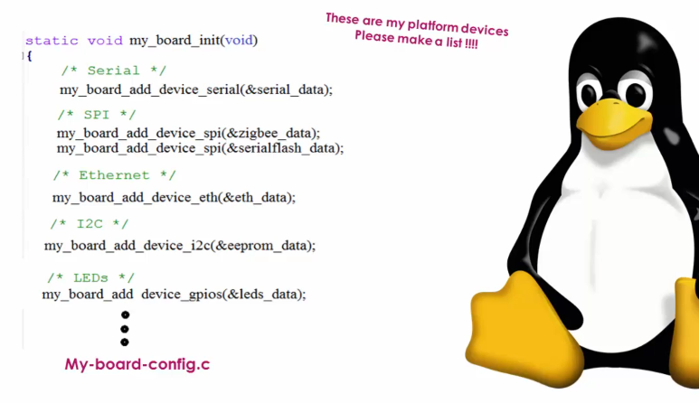
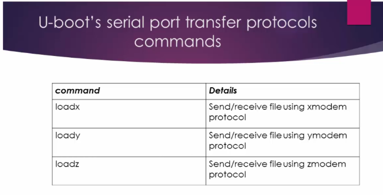
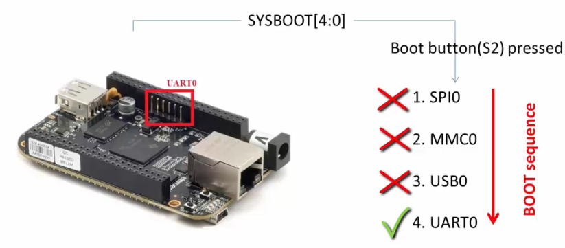

## Embedded linux development with Beaglebone black    
   
Official website for [Beaglebone black](https://www.beagleboard.org/boards/beaglebone-black).  
    
[Design](https://git.beagleboard.org/beagleboard/beaglebone-black) contain Beaglebone black **Schematic** and **Reference Manual** in Docs folder of this repository.  

Go to [wiki](https://elinux.org/Main_Page) and find your board BeagleBone Black for ton of information)  
    

## Introduction (just enough to get started):

It is actually redundant to explain about Beaglebone hardware, when you can get all the info regarding this board from its official site here     
   
The community describes this board as follows

“Beaglebone Black is a low-cost, community-supported development platform for developers and hobbyists. Boot Linux in under 10 seconds and get started on development in less than 5 minutes with just a single USB cable.”

So, you should pay attention to these points     
    
## 1. It’s an open source h/w, s/w platform.
That means, if you are planning to design your own single board computer (a SBC), then you can reuse the Beaglebone black’s design, schematics, software, etc. So, the beaglebone hardware enables you to quickly come up with your own customized board. Most of the companies ,what they do is , they take the BBB hardware design, like part numbers, schematics , BOM etc and they add customer specific add-ons or features then release the product to the market.   
   
When the hardware team is working on the new hardware, the software team will not sit idle, they test their software, drivers, and applications on reference ( such as Beaglebone ) board, which greatly reduces the time to market effort.  
   
## 2. A low cost Single Board Computer (SBC)   
   
The BBB hardware is powerful yet low cost SBC currently available.   
   
So, what’s a SBC?   
   
When a single piece of circuit board, comprises most of the personal Computer hardware/software components, then it is called as a SBC. Of course you cannot have terra bytes of hard disk mounted on a circuit board, but it has significant amount of on board memory, it has wireless/wired connectivity, it has USB interfaces, it can run operating systems, you can connect to monitor or projector. Yes! You can compare this with the motherboard of your PC.  
   
Hence it is called as single board computer. Another most famous SBC is Raspberry PI but it is partially an “open hardware” because the SOC manufacturer hides the details.    
   
   
   
    
    
    
    
    
    
     
  
    
   
   
    
## Connecting BBB and USB to serial TTL convertor hardware or cable    
   
 As I mentioned in the previous document, you can use either a standalone USB to serial TTL convertor hardware like shown below (you should arrange for the connecting jumper wires though)   
   
   
Or, you may use the USB to serial TTL converter with cable like below. This is more convenient because it has good length and you need not to bother about connecting to BBB using jumper wires.

This cable has embedded “USB to serial “converter chip inside.  
   
   
   
And always remember when you connect  “USB to Serial Convertor” to any hardware like BBB, the TX pin of this module should go to the RX pin of the another board, in this case BBB. Take look in to the table below for connection details. It’s very simple.   
   
   
   
Here is a BBB schematic details of J1 UART0 pins   
    
   
   
## Serial port monitoring software   
    
   
   
**Using Minicom**   
   
Confirm by running `sudo minicom` command in terminal to see if `Minicom` already installed  
    
OR   
   
Install on Ubuntu by first running `sudo apt-get update` and then `sudo apt-get install minicom`   
   

## Configure minicom on first time install    
   
Just connect your USB to UART convertor hardware to the PC (not beaglebone hardware.)  
   
Run the `dmesg` on terminal   
     
   
      
> Chipset converter `pl2303` is detected and attached to ttyUSB0. Alternatively, if you are using FTDI, then following output will be shown in terminal as shown below    
   
    
   
Type `sudo minicom -s` to configure the minicom and configure `Serial port setup` by choosing  
    
   
   
Keep the **Hardware Flow Control** and **Software Flow Control** as **No** as according to BBB Schematic, it doesn't have this feature available on the board   
    
   
   
Finally `Save setup as dfl` so we don't have to setup the configuration again and again.  


## BBB getting started   
   
Let us do some experiment with our new Beaglebone black Revision C hardware. Remember, the Beaglebone hardware comes with the Debian flavor of the Linux operating system which is stored in the EMMC memory of your Beaglebone hardware. when you give power (USB mini B connector over P4) to the Beaglebone hardware, it boots the pre-built or pre-loaded Debian Linux distribution from this board. A drive FAT based file system `BeagleBone Getting Started` will appear upon successful booting of a board, They have divided the EMMC memeory to different partitions like FAT and ext3 etc. and they have stored the images over there. You will find a page `START.htm` inside the Drive which contains Getting started documentation with Beaglebone hardware. Inside `Drivers/Windows/` you will see driver `BONE_D64.exe` which enables the Beaglebone's internet over USB capability. Hence you need not to connect the Ethernet cable as Beaglebone supports the Ethernet over the USB interface.   
    
> [!NOTE]   
> If some reason you failed to install the driver then you have to disable `Driver signature enforcement` on windows pc.  
    
The installation of the driver resulted in creation of the interface in the `Network connections > Uidentified network | Remote NDIS compatible Device` , which allows BBB to communicate with PC over USB cable (Ethernet over USB)    
    
## BBB Web Interface    
    
The BBB Debian OS running on the board already running a web server which you can connect to by typing the IP address `http://192.168.7.2` for Windows (You can look for the right IP address on `START.htm` according to your OS as shown below)  

      


 ## Communicating with BBB    

We will use **minicom** to talk to FTDI USART-TTL and **SSH** to connect to BBB (over internet to USB). We will accomplish both `minicom` and `ssh` from two different terminals inside Ubuntu. 

Initially FTDI may not show up on Ubuntu (when we run `dmesg`) as it is owned by Windows OS however we will go to Virtualbox and select `Devices > USB > FTDI` to change its ownership to Ubuntu. Now, it will appear (i.e. ttyUSB0) inside Ubuntu. There we will go to `Serial port setup` and rest follow the section `Configure minicom on first time install` as explained previously. Now reset your board and you will get the logs on Ubuntu's minicom.   

Let's login now in the Serial window of minicom with debain username `debian` and default password as `temppwd`. Now, check the `ifconfig`. You will find two interfaces `usb0` **192.168.7.2** (internet over usb, as beaglebone is connected with laptop over P4 through USB mini B, we will also use it to connect over ssh on seperate terminal) and `usb1` **192.168.6.2**  communicating over USB-TTL FTDI with minicom.     

On second terminal run `ping 192.168.7.2` to confirm that communication with beaglebone hardware is working over USB mini B at P4 (Internet over USB). You can now ssh beaglebone with `ssh -l debian 192.168.7.2` 
    
> [!NOTE]    
> Use the Virtual machine only when you want to compile the kernel, bootloader, or use the build root software i.e. busy box. However if you only want to write application for the beaglebone then just use the **eclipse** which is installed on your primary operating system such Windows, Mac etc. **You don't need to install Eclipse on the virtual machine for application development purpose**    
    

# BBB Linux booting process                    

Let's explore, How to boot the Linux kernel on the ARM based hardware such as Beaglebone Black target hardware which is powered by the SOC AM335x (ARM cortex A8 processor) from Texas Instruments.    
      
To run Linux on this embedded board, we need minimum of 4 software components as shown below.     
      
   
    
## RBL (ROM Boot Loader)     
    
A very tiny boot loader with limited functionalities runs out of the ROM memory (176 Kb, another SOC internal RAM memory of 128 Kb) of the SOC when you power up the board. This boot loader is written by the vendor, in our case, written by the Texas Instruments, and stored in the ROM of the SOC during taping out of the chip. You cannot change this boot loader (cannot overwrite). You may also not get the source code of this boot loader. The job of the ROM is to set up the, Stack setup, calling `main()`, initialising watch dog timer (Initialised for 3 mins), and SOC PLLs clock 500 MHz to A8 by MPU_ADPLLS etc. Based on the value of 15:14 bits of the SYSBOOT register, the RBL comes to know about the value of the external crystal connected to the SOC (in our case 24MHz Crystal at the bottom of BBB with part name Y2. 14th bit SYS_BOOT14(LCD_DATA14) tied to high voltage and 15th pin SYS_BOOT15(LCD_DATA15) tied to low voltage as shown below). Finally to load and execute the second stage boot loader **SPL/MLO** from the internal memory (_SRAM_) of the SOC.   
    
    
     
      
     
      
     
        
     
    
     
     
## SPL/MLO (Secondary Program Loader / Memory Loader)   
     
The job of the Secondary stage boot loader is to initialise the SOC to a point that the Third stage boot loader **U-boot** can be loaded into external RAM (DDR memory) of the board.       
     
    
     
Suppose, if you want to clock your MPU at 300MHz instead of say 500MHz, you can only do that in the second stage boot loader (by reconfiguring the PLL) where you can bring down the clock frequency to 300MHz and vice versa   
    
RBL must load and execute the second stage boot loader within 3 minutes (Watchdog expiry)  Let's say, it finds the second stage boot loader on the e-MMC memory of the board. Then the ROM code copies the MLO/SPL to the internal RAM of the SOC.       
     
    
     
The MLO or SPL will have its own image header which is decided by TI itself. From the image header, it will get 2 important information. One is the load address and another one is the total size of the MLO.         
     
    

> [!NOTE] 
> Remember that, MLO will not load the third stage boot loader like U-Boot to the internal RAM of the SOC. Why? Because, the internal RAM is only of 128KB. U-boot obviously will not fit there. So, it copies it to the DDR memory which is external to the SOC.    
     
           
     
**Why AM335x RBL cannot load the Uboot directly to DDR?**   

ROM code won’t be having any idea about what kind of DDR RAM being used in the product to initialize it. DDR RAM is purely product/ board specific. Let’s say there are 3 board/product manufacturing companies X,Y,Z. X may design a product using AM335x SOC with DDR3. In which lets say DDR3 RAM is produced by microchip. Y may design its product using AM335x SOC with DDR2 produced by Transcend and Z may not use DDR memory at all for its product.

So, RBL has no idea in which product this chip will be used and what kind of DDR will be used, and what are DDR tuning parameters like speed, bandwidth, clock augments, size, etc. 

RBL just tries to fetch the SPL found in memory devices such as eMMC and SD card or peripherals like UART,EMAC,etc.

> [!NOTE] 
> And in the SPL/MLO, you should know, what kind of DDR is connected to your product and based on that you have to change the SPL code , rebuild it and generate the binary to use it as the second stage boot loader.

For example the Beaglebone black uses DDR3 from Kingston and if your product uses DDR3 from transcend, then if the turning parameters are different then you have to change the DDR related header files and the tuning parameter macros of the SPL , rebuild and generate the binary   
    

Now, let's see practically booting of the ROM bootloader and the MLO on the BeagleBone hardware. For that, first let's use the [pre-built binaries](prebuilt_images/Angstrom_Demo/) named MLO-beaglebone-2013.04.    
     
You need a micro SD card and partition (with Gparted, you can download GUI via Ubuntu Software center) card into two. One partition must be of type FAT filesystem (preferably with space of 1GB) and another partition should be of type EXT3. But, for the time being, we will not be using the

> [!NOTE] 
> Remember, never operate command line using root privileges. instead use `sudo` command   
    
           
     
Running `$ sudo dmesg` and check your SD card (which may identified by the PC as **sdb** device).   
   
Delete the /dev/sdb which will make it unalloacted. Keep first partition as **fat16**, New size as **1024 MB** and Label as **BOOT**    
    
Second partition as **ext3**, New size as whatever is remaining, and Label as **ROOTFS**  now apply the changes by clicking on Green color Tick.

Lastly, Right click on **fat16** partition, select `Manage Flags > boot`   
   
Copy the MLO-beaglebone-2013.04 from the [pre-built binaries](prebuilt_images/Angstrom_Demo/) and paste it into BOOT partition by renaming it to _MLO_.     
`$ cp MLO-beaglebone-2013.04 /media/<user-name>/BOOT/MLO     
     
Take out the SD card and insert it into BBB and connect both cables (one connect to BBB and another USB-TTL convertor to PC, USB-TLL needed as we cannot see the log messages as Internet over USB is not configured for BBB)     
     
   

It will boot the MLO however will encounter with an error as it could not find the u-boot **spl: error reading image u-boot.img, err - -1** which we will flash into BOOT partition in the next section     


## U-boot      
    
The job of the Third stage boot loader is to load and execute the Linux kernel from the DDR memory of the board. Hence the booting actually takes place in 3 stages.

_And to complete the successful boot of the **Linux kernal**, we also need a root file system **RFS**_    
     
    
     

Now, let's see practically booting of the u-boot bootloader on the BeagleBone hardware. For that, first let's use the [pre-built binaries](prebuilt_images/Angstrom_Demo/) named `u-boot-beaglebone-2013.04-r0.img` and placed it into BOOT partition of SD card which was partitioned in the previous section. Now SD card BOOT paritioned drive (fat16) contain **MLO** and **u-boot.img**.     
`$ cp u-boot-beaglebone-2013.04-r0.img /media/<user-name>/BOOT/u-boot.img    

    

It will boot until the end where it couldn't find the Linux image as message says **File not found /boot/uImage**     
   

**MLO and u-boot.img summary**   
    

    

You should also provide one file called **uEnv.txt**, which consist of environmental variable values of the u-boot which directs u-boot how to behave. You can override any default u-boot behavior by using this file.        
    
    
  
Now u-boot always looks for uImage (zImage plus u-boot header). zImage is elf binary format of the Linux kernel and if you append the u-boot header to it, it becomes uImage. From the image header, u-boot gets lot of information about the Linux kernel.         
    
    
    
        
     
Image header shown which u-boot expects on top of the zImage. This header is of 64 bytes in total. let's quickly download the [pre-built Linux image](prebuilt_images/Angstrom_Demo/) named `Angstrom-systemd-image-eglibc-ipk-v2012.12-beagleboard.rootfs.tar.xz`, extract and you will find **uImage-3.8.13** in **boot** folder which is pretty old Linux kernel. However we will copy all the extracted folders into our SD card **ROOTFS** partition.     
`$ cp -r * /media/<user-name>/ROOTFS/`    
`$ sync`    
and we'll try to boot it. Then analyse the logs sent by the u-boot.

Later, we will see how to create our own root file system using the Busybox, and by taking the help of Buildroot.   
    
Now you see the ROOTFS partition of the SD card consist of the root file system and u-boot.img (in BOOT partition) supposed to load the Linux kernel. But u-boot has no idea where exactly the Linux kernel is actually residing in the SD card. However the Linux kernel image is actually present in the `ROOTFS/boot` folder of the second partition. Hence we have to use `uEnv.txt` file to tell u-boot where exactly the Linux kernel is present. Add `uEnv.txt` (with the content shown below) into _BOOT_ folder of **fat16** along with **MLO** and **u-boot.img**.   
```
console=ttyO0,115200n8
ipaddr=192.168.7.2
serverip=192.168.7.1
loadaddr=0x82000000
fdtaddr=0x88000000
loadfromsd=load mmc 0:2 ${loadaddr} /boot/uImage;load mmc 0:2 ${fdtaddr} /boot/am335x-boneblack.dtb
linuxbootargs=setenv bootargs console=${console} root=/dev/mmcblk0p2 rw
uenvcmd=setenv autoload no; runloadfromsd; run linuxbootargs; bootm ${loadaddr} - ${fdtaddr}
``` 
We are instructing u-boot to keep the Linux kernel at `0x82000000` and dtb file at `0x88000000`. `runloadfromsd` is a custom name, you can give any of your liking.  
    
```
$ umount /media/<user-name>/BOOT
$ umount /media/<user-name>/ROOTFS
$ sudo minicom
```   
Insert/Boot from the SC card   
    
   

As shown above, uboot hands over control to Linux kernel          
     
**Reading U-boot header information of the uImage manually by using U-boot commands**   

1. Load the uImage from Memory device (SD card/eMMC) in to the DDR memory of the board.   
2. Use the memory dump command of U-boot to dump header information.  
    
    

```
U-Boot# help load
load - load binary file from a filesystem  

# load uImage from 2nd partition into RAM (DDR) location 0x82000000
U-Boot# load mmc 0:2 0x82000000 /boot/uImage   

U-Boot# help md
md - memory display

# display 64 bytes header informtion starting from 0x82000000
U-Boot# md 0x82000000 4

U-Boot# help imi
iminfo - print header information for application image

U-Boot# imi 0x82000000
```         
     
## BeagleBone Board Boot options    
     
you can boot the AM335x SOC from the following boot sources    
      
1. NAND Flash    
2. NOR Flash (eXecute In place, XIP)    
3. USB    
4. eMMC    
5. SD card   
6. Ethernet    
7. UART   
8. SPI          
    
_Page number 4106 of the [TRM](Docs/TRM_AM335x_techincal_reference_manual.pdf) , you will find the below table._    
     
   
    
Take a look at _SYSBOOT[4:0]_ `SYSBOOT` is one of the register of this SOC and its first five bits decide the boot order .   
   
For example,   
When SYSBOOT [4:0] = 00000b (This is reserved, you cannot use this configuration)
When SYSBOOT [4:0] = 00001b then **1st** SOC will try to boot from UART0, if fails, **2nd** it tries to boot from XIP (XIP stands for eXutable In Place memory like NOR Flash), if that also fails, **3rd** it will try to boot from MMC0, if no success, **4th** it tries to boot from SPI0, if that also fails, then SOC outputs the error message and stops.  

## How SOC decides the boot order?    

When you reset the SOC, the code stored in the ROM of the SOC runs first !    
     
   
    
The code stored in the “ROM” is called **ROM boot loader**, this is programmed in to the ROM of the SOC during taping out of the chip, you cannot change it as it is in the ROM Read only.

The job of the ROM is to set up the SOC clock, watch dog timer, etc and load the second stage boot loader (MLO or SPL). By reading the register SYSBOOT [15:0], and based on the value of SYSBOOT[4:0] it prepares the list of booting devices. The register SYSBOOT [15:0] value is decided by the voltage level on the SYSBOOT pins.

Hence, if SYSBOOT[4:0] = 00011b, then boot order will be , UART0, SPI0, XIP, MMC0 (as shown in the above table). Therefore, we can say that, The SYSBOOT pins configure the boot device order (set by SYSBOOT[4:0]). Some board, will give you the control to change the SYSBOOT[15:0] value by using dip switches like below.      
     
   
    
However, in the BBB, there are no such dip switches to configure the SYSBOOT pins. BBB has some other circuitry to decide the SYSBOOT pins voltage level, read on!!    
    
## BBB Boot order configuration circuit   
   
In BBB you will find this circuitry, (In the [SRM](Docs/BBB_SRM.pdf))    
     
   
     
Here observe that SYS_BOOT2 is connected to a button S2 (Boot button) of the BBB.

When you simply give power to the board, You will find the voltage level as below.

SYS_BOOT0 = 0V
SYS_BOOT1 = 0V
SYS_BOOT2 = 1V
SYS_BOOT3 = 1V
SYS_BOOT4 = 1V

You can confirm this by measuring the voltage level using Mutlimeter (voltage of 45, 44, 43,41, 40 pins of the expansion header P8 of the board as SYSBOOT[4:0] = 11100)   
     
   
     
And when you press the S2 button, SYS_BOOT2 will be grounded , so SYSBOOT[4:0]= 11000     
      
Now based on S2 (BBB boot button) we got 2 boot configurations:

1. S2 released (SYSBOOT[4:0] = 11100)

The boot order will be

MMC1 (eMMC)
MMC0 (SD card)
UART0
USB0

2. S2 pressed (SYSBOOT[4:0] = 11000)   
    
The boot order will be

SPI0
MMC0 (SD card)
USB0
UART0

So, to conclude, there are 5 boot sources supported for this board including SPI.    
     
1) eMMC Boot(MMC1):

 eMMC is connected over MMC1 interface, This is the fastest boot mode possible, eMMC is right there on your board, so need not to purchase any external components or memory chip. This is the default boot mode. As soon as you reset the board, the board start booting from loading the images stored in the eMMC.   
 
 If no proper boot image is found in the eMMC, then Processor will automatically try to boot from the next device on the list. 

2) SD Boot:

 If the default ( that is booting from eMMC) boot mode fails, then it will try to boot from the SD card you connected to the sd card connector at MMC0 interface. 
 
 If you press S2 and then apply the power, then the board will try to boot from the SPI first, and if nothing is connected to SPI, it will try to boot from the MMC0 where our SD card is found   
 
 Also remember that we can use SD card boot to flash boot images on the eMMC. So if you want to write new images on the eMMC  then you can boot through sd card, then write new images to eMMC, then reset the board, so that your board can boot using new images stored in the eMMC.  We will do these experiments later in this course. Don’t worry!

3) Serial boot:

In this mode, the ROM code of the SOC will try to download the boot images from the serial port.

We have separate experiment on this boot mode and its very interesting. 

4) USB BOOT:   

You may be familiar with this boot mode, that is booting through usb stick!   

You would have booted your PC through the usb stick. What you do is, you restart the PC, then press bios button to put the PC in to bios mode, there you select boot form usb, right  

It is very similar, when you reset the board, you can make your board to boot from the USB stick. 

## More details about ROM Code Booting procedure!

These are the 2 flow charts, you can find in the [TRM](Docs/TRM_AM335x_techincal_reference_manual.pdf) **page 4103** of the am335x SOC    
     
   
         
Here, you can see that the ROM code goes through its boot device list to load the Second stage boot loader (SPL/MLO). **It will prepare the boot devices list based on the value of SYSBOOT pins**. 

## The ROM Code start-up procedure    
    
(page 4102)       
     
     


# Linux boot sequence   

    

Take a look into the flow control diagram above, from **U-Boot** to **Linux** to launching of the very **first application** .

1. **U-boot** hands off the control to the `head.s` file in the Boot strap loader of the Linux   
2. Then, the `head.s` calls miscellaneous.c (`misc.c`) file. That also belongs to the **Linux's Bootstrap Loader** to uncompress the compressed image. 
3. Then the control comes to another `head.s` file of the Linux kernel.    
4. And from `head.s` file of the Linux kernel, the control comes to the `head-common.c`   
5. And then on to `main.c` file of the Linux kernel,   
6. Lastly, the first application of the Linux kernel that is `init` is launched.   
     
**How U-boot hands off control to the "Boot Strap Loader" of the Linux kernel??**  

Let's explore from the source file `bootm.c` of the u-boot [source code](https://source.denx.de/u-boot/u-boot) OR [mirror](https://ftp.denx.de/pub/u-boot/).    

`$ sudo nano arch/arm/lib/bootm.c`     
    
This is the code of the U-Boot which actually picks up Linux kernel from the memory and hands off the control to the Linux kernel. There is a function called `static void boot_jump_linux(struct bootm_headers *images, int flag)` takes two arguments, **bootm_headers** a structure and a flag.   
    
```c
static void boot_jump_linux(struct bootm_headers *images, int flag)
{
#ifdef CONFIG_ARM64
	...
#ifdef CONFIG_ARMV8_PSCI
		...
#else
	unsigned long machid = gd->bd->bi_arch_number;
	char *s;
	void (*kernel_entry)(int zero, int arch, uint params);
	unsigned long r2;
	int fake = (flag & BOOTM_STATE_OS_FAKE_GO);

	kernel_entry = (void (*)(int, int, uint))images->ep;
#ifdef CONFIG_CPU_V7M
	...
#endif
	...
```    
    
`kernel_entry` function pointer is actually initialized to `images->ep` that is an entry point (Linux entry point). You can find the field `ep` in the structure `bootm_headers` by `$ grep -r "bootm_headers" *` found in `include/image.h`   
    
```c
#ifndef USE_HOSTCC
	struct image_info	os;		/* os image info */
	ulong		ep;		/* entry point of OS */

	ulong		rd_start, rd_end;/* ramdisk start/end */

	char		*ft_addr;	/* flat dev tree address */
	ulong		ft_len;		/* length of flat device tree */

	ulong		initrd_start;
	ulong		initrd_end;
	ulong		cmdline_start;
	ulong		cmdline_end;
	struct bd_info		*kbd;
#endif
```    
    
    
    
After that, this code is storing the value of `ft_addr` into the variable called `r2`. **ft_addr** is the RAM address at which the device tree binary is located. DTB or FTT, that is Flattened device tree is actually a binary which describes the various peripherals present on the board. That Binary Tree is needed by the Linux kernel during the boot.   
    
    
    
Next the U-Boot is dereferencing the kernel entry point `kernel_entry(0, machid, r2)` and sends three important arguments.   
    
       
    
It means, I have detected this machine ID and U-boot is passing that information to the Linux kernel And 'r2' is where the ft address is stored. Hence when Linux comes to know about this machine ID, it will execute those initialization routines, which are required for this machine id. At this point the U-Boot is actually handing off control to the Linux kernel's bootstrap loader.   
   
   

This code actually calls the **Start** routine in the `head.S` file of the bootstrap loader. which can be found in the [Linux source of Beaglebone board](https://github.com/beagleboard/linux) at location `$ vi arch/arm/boot/compressed/head.S` and look for `/start:`    
     
     

If you go little further, you will find two lines of code where it is saving the architecture ID (machine id to `r7`) and the dtb address from `r2` (`kernel_entry(0, machid, r2)`) to `r8`.   
Furthermore, `head.S` file of the bootstrap loader calls the `misc.c` to decompress the kernel (search `/decompress_kernel`) by branching `bl` to `misc.c`

Now go to `misc.c` by typing `$ vi arch/arm/boot/compressed/misc.c` and search again for `/decompress_kernel`. Here you will find the function `void decompress_kernel()`    
    
Next, the control from the `head.S` of **Linux's Boot Strap Loader** to another `head.S` of **Linux Kernel** which you can locate in `vi arch/arm/kernel/head.S`. This `head.S` is architecture specific code (doesn't depend upon any SOC family). It's a generic startup code for arm processors which does arm specific initialization as shown below.   
    
     
 
> [!NOTE]    
> Remember that the uncompression and relocation of the Linux kernel image is not the responsibility of the U-Boot rather it is done by the **Linux's Boot Strap Loader** which is glued to the **Linux Kernel** image.    
    
If you read further about `vi arch/arm/kernel/head.S` it says the following. (MMU=off means no virtual addressing is enabled yet)    
     
    

Now let's explore some of the important sub routines called by this file.     
    
**Check for proper processor type**     
     
`__lookup_processor_type__` call will search for the processor architecture present on the board. After figuring out the processor type, it calls the appropriate processor specific initialization routinesmfound in the respective **processor specific files** in the path `arch/arm/mm/proc-*.S`.     
   
You will find in the `arch/arm/mm` directory that, every processor has its own processor specific initialization file. Basically the processor specific calls are made to deal with the memory management unit as explained here in these comments. _Perform a soft reset of the system. Put the CPU into the same state as it would be if it had been reset, and branch to what would be the reset vector_    
    
Also note that, the register r10 holds the processor info structure related to a processor which is detected by the call to `__lookup_processor_type__` previously as explained in the comment says that _on return, the CPU will be ready for the memory management unit to be turned on_, which confirms that all the processor specific calls are made to initialize the mmu before turning it on. It means, before giving control to the Linux generic code, mmu initialization and turning on of the MMU is important. That's the duty of these architecture specific codes.    
    
Another important assembly subroutine enable MMU which initializes the page table pointers and turn on the MMU, so that the kernel can start running with virtual address support.   
    
 

Next it branches to `start_kernel()` (C function implemented in architecture independent generic file `main.c`) from **head-common.S** file located in the same path **arch/arm/kernel**. Now from here the flow control comes to the file `main.c` of the Linux kernel.   
     
    
     
At this point, all the architecture dependent initialisations are over, your CPU ARM cortex- A8 is ready with the MMU support and Linux is all set to do architecture independent kernel initialisation (through `main.c`). And if you analyse the code of `head.S`, it's particularly interested in searching of CPU type like whether it belongs to ARM 9, ARM 10 or ARM cortex A8, etc. And once it comes to know about the architecture type, it majorly initialises the MMU and creates the initial page table entries and then enables the MMU of the processor for virtual memory support, before giving control to the main.c file of the Linux kernel which is the generic one.
     
**Launch of INIT**    

The function `start_kernel()` in init main.c code does all the startup work for the Linux kernel from initialising the very first kernel thread, all the way to mounting a root file system and executing the very first user space Linux application program.

The entry point into this main.c is `start_kernel()` function (in `linux-4.4/init/main.c`) which is a very huge function calling lots of other initialisation functions.   
     
  		 

Now take a look little further down at line _895_. Here the kernel prints the `linux_banner` string `pr_notice("%s", linux_banner)`, which you can identify in the log.   
    
  		

The `linux_banner` string can be found in the file `linux-4.4/init/version.c`

Furthermore, `start_kernel()` does lots of early initialization of the Linux kernel such as:    
    
- Extracting the command line arguments sent by the boot loader     
- Initialisation of the console to get the error messages    
- Memory management initialization    
- Scheduler initialization    
- Timer initialization    
- High resolution timer initialization    
- Software IRQ initialization

Hence, It initialises various subsystems of a Linux kernel before mounting the root file system and launching the very first Linux application. You can learn more by going through all these helper functions one by one inside `start_kernel()` and exploring what exactly they do.

Finally, It calls a function called `rest_init()` and inside it creates two threads `kernel_init` (with pid 1) and `kthreadd`. It then starts scheduler `schedule_preempt_disabled()` and then kernel is going to **CPU idle loop** which is actually inifinite while(1) loop named `cpu_startup_entry(CPUHP_ONLINE)`.    
    
The `kernel_init` kernel thread will then execute the very first user application called init. That's the reason `init` application actually inherits its kernel threads pid number 1 from `kernel_init`. Whereas `kthreadd` kernel thread is used to spawn other kernel threads.   
    
```c
/*
	 * We need to spawn init first so that it obtains pid 1, however
	 * the init task will end up wanting to create kthreads, which, if
	 * we schedule it before we create kthreadd, will OOPS.
	 */
	pid = user_mode_thread(kernel_init, NULL, CLONE_FS);
	/*
	 * Pin init on the boot CPU. Task migration is not properly working
	 * until sched_init_smp() has been run. It will set the allowed
	 * CPUs for init to the non isolated CPUs.
	 */
	rcu_read_lock();
	tsk = find_task_by_pid_ns(pid, &init_pid_ns);
	tsk->flags |= PF_NO_SETAFFINITY;
	set_cpus_allowed_ptr(tsk, cpumask_of(smp_processor_id()));
	rcu_read_unlock();

	numa_default_policy();
	pid = kernel_thread(kthreadd, NULL, NULL, CLONE_FS | CLONE_FILES);
	rcu_read_lock();
	kthreadd_task = find_task_by_pid_ns(pid, &init_pid_ns);
	rcu_read_unlock();
```   
    
If we visit `kernel_init` function;  

```c
static int __ref kernel_init(void *unused)
{
	int ret;

	/*
	 * Wait until kthreadd is all set-up.
	 */
	wait_for_completion(&kthreadd_done);

	kernel_init_freeable();
	/* need to finish all async __init code before freeing the memory */
	async_synchronize_full();

	system_state = SYSTEM_FREEING_INITMEM;
	kprobe_free_init_mem();
	ftrace_free_init_mem();
	kgdb_free_init_mem();
	exit_boot_config();
	free_initmem();
	mark_readonly();

	/*
	 * Kernel mappings are now finalized - update the userspace page-table
	 * to finalize PTI.
	 */
	pti_finalize();

```				

The function `free_initmem()` reclaims the memory which are being used by the initialisation function so far. Because, those functions are no longer needed. As log shows `Freeing init memory: 248K` which is reclaimed by the kernel.   
    
Further down it tries to run the init application and start from `/sbin/init` if it fails then it tries to find init from other location i.e. `/etc/init` and if everyting fails then it simply executes the shell application `/bin/sh` which is present in the root file system and just returns.

 ```c
 	if (execute_command) {
		ret = run_init_process(execute_command);
		if (!ret)
			return 0;
		panic("Requested init %s failed (error %d).",
		      execute_command, ret);
	}
	...

	if (!try_to_run_init_process("/sbin/init") ||
	    !try_to_run_init_process("/etc/init") ||
	    !try_to_run_init_process("/bin/init") ||
	    !try_to_run_init_process("/bin/sh"))
		return 0;

	panic("No working init found.  Try passing init= option to kernel. "
	      "See Linux Documentation/admin-guide/init.rst for guidance.");
}
```    

If none of these programs found in these location, then it actually throws an error `panic("No working init found.....)`

And note that you can also mention the path of the init program `if (execute_command)` by using the Linux command line argument called init. You have to give the path of the init program, in case you have any customised or some other path. Then it first checks the `execute_command` first. That's how the Linux finally launches the user application.mEither it launches the init `/sbin/init` or if no init found then at least it will launch the shell application `/bin/sh`.

That's how the control comes all the way from boot loaders `u-boot` to Linux bootstrap loader to linux kernel to launching of the very first application. And init is a application which is responsible for launching other applications. As we make a progress, we will experiment practically by creating our own root file system and keeping the init program and we'll see, how we can use the init program to launch other applications or other kernel services.   

  
    				

# Updating the eMMC memory with the latest debian OS image and BBB Network configurations.   
   
We will flash eMMC of the Beaglebone board and then boot the Beagleboard using the eMMC memory (Revision C, onboard 4GB of eMMC memory) and the board already comes with pre-stored Debian OS, However we will reflash the Debian OS present on the eMMC memory of the board (for learning purposes and understand the working).    
    
The **eMMC** memory is actually connected to the **mmc1** interface and the **micro SD card** connector is connected to the **mmc0** interface of the AM335x SOC, And we also have 512 MB of **DDR** memory connected to the DDR interface of the SOC. 

  
    
      
> [!NOTE]
> Remember, the board always tries to boot from the mmc1 interface first by default (eMMC Memory) when you power up the board. **However, we will take the help of Micro SD card to flash the eMMC memory** (flashing the bootable images and root file system onto the eMMC memory).   
    
1. Download the latest [Debian OS image](https://www.beagleboard.org/distros) (i.e. am335x-debian-11.7-iot-armhf-2023-09-02-4gb.img.xz). You can use `xz-utils` to extract `$ unxz am335x--.img.xz`      
    
2. Write that bootable image to the SD card using disk writing software [etcher](www.balena.io/etcher) by downloading the software on ubuntu. If it doesn't run by `$ ./balenaEtcher-1.18.11.AppImage` then make it executable by chmod +x. You might as well install `apt-get install fuse` if this package is missing.   
    
3. Insert the SD card into the beaglebone and then make beaglebone boot from the SD card (Power down BBB by long press of Power button, insert the SD card, keep pressing the S2 button while pressing the Power button gently and release the S2 button shortly, and you will see the LEDs of BBB blink linearly, probably take 5-10 mins).     
   
4. Execute the eMMC flasher script by logging into BBB via SSH `$ ssh -l debian 192.168.6.2` (used to be at `/opt/scripts/tools/eMMC` with the name `init-eMMC-flasher-v3.sh` but now you can simply run `sudo enable-beagle-flasher` to flash all the contents of the SD Card on to the eMMC memory) and finally reboot `sudo reboot` and BBB LEDs will blink linearly for awhile when it stopped then you can safely remove the SD Card.   
     
      
> [!NOTE]    
> If your board already running latest version of debian OS image, then you NEED NOT to try this.   
> Check your BBB debian OS version `$ lsb_release -da` and compare the output with debian latest release. (You have to log into BBB by `minicom` if you aren't able to find the right `/dev/<PORT>` then use `$ dmesg` command)

To configure BBB Network connection over USB, follow the Networking [guide](Docs/Networking.pdf) 
   
As disscussed in the Networking guide following commands has to be saved in the **BBB** and **Host** machine.   

    

    
     

# Linux Device Tree		 
     
This is also called as Flattened device tree.   

Imagine, we have our own custom board (Beaglebone hardware or any other board with SOC as shown below) and it is based on ARM architecture and the board has got couple of on board peripherals like the Zigbee transceiver, Serial flash, EEPROM, SD card connector, USB interface etc and they are connected with some bus interfaces like USART, SPI, I2C, SDIO, USB, etc.	    

    
     
Now, interestingly the onboard peripherals are not dynamically discoverable which are connected to SPI, I2C, SDIO, Ethernet, etc., have no capability to announce there existence on the board by themselves to the operating system like Linux. Because, those interfaces (like I2C, SPI, SDIO, etc.) don't have that intelligence to support dynamic discoverability. Even though those peripherals are there on the board, the operating system has no idea about configuring them. On the other hand, When you connect a pen drive or thumb drive via USB to use the port, it has the intelligence to announce its presence to the operating system dynamically by pushing some information.

Now the question is, how can we make Linux kernel know about these platform devices (**USB is not platform device as it is self-discoverable**) or peripherals present on the board or announce their existence to the kernel, since they cannot do it themselves.

One solution was to go for a static way, to hard code these platform device details in a file called the board file (as shown below) and when the kernel calls the function `my_board_init()` add each and every platform device to the kernel subsystem with a platform specific data (i.e. data structure which actually describes the peripheral). As the Board file is basically the part of the Linux kernel, so when you modify to add new entries, you have to recompile the kernel. Then only your changes will take effect 
   
    
   
When the corresponding driver is loaded, the Linux calls the "probe" function of the driver and the platform data will be passed to the driver and the driver will then initialize the peripheral.    
    
  		
     
For instance, let's say the name of the platform device zigbee is zigbee100. The corresponding driver name must also be same as the platform device name (zigbee100.ko). When you load this driver the Linux binds the device with this driver. So, Linux immediately calls the "probe" function of this driver and the driver will then take care of initializing the peripheral.   
    
     
    
When you have different boards, each board will have different on board peripherals. Hence for every board you'll be having one board file. Consequently for each board, you'll be having separate kernel image. Kernal image of one board will not be compatible with other boards.   
    
  		
    
**This was a problem which the Linux community wanted to solve.** They wanted to cutoff the dependency of platform device enumeration from the Linux kernel. That is hard coding of platform device specific details in to the Linux kernel. Hence the ARM community came up with the idea called **Device Tree** also called as **Flattened Device Tree Model**.    
    
In this case, instead of hard coding the hardware details into the Linux kernel board file, every board vendors has to come up with a file called DTS (Device Tree Source File or Device Tree Structure). This file actually consists of all the details related to the board written using some predefined syntaxes. This file consists of lots of data structures, which describe all the required peripherals of the board.   
    
		
    
And this file will be compiled using a _Device Tree Compiler_ that we call **DTS**. This is one kind of the special compiler to convert this DTS file to the stream of bytes, we call this binary as **DTB**. So, the DTB is a stream of bytes contain encoded details of the hardware, which is derived from DTS compilation.    
     
				 

Hence there will be one DTB for every board and when you edit that DTS file to add a new entry. You need not to compile the kernel again and again, you just need to compile the DTS file and get the new DTB. Finally when the kernel boots, you should tell the kernel where this DTB resides in the memory, so that the Linux kernel can load that DTB file and extract all the hardware details of the board.     
     
			


# uEnv.txt file   

Open the minicom, reset the board. Board will boot from eMMC. **Now halt it at the U-Boot by keeping the Space key pressed and then press S3 (power button)**. 

Type the command `help` on the U-Boot command prompt and the U-Boot will list out all the commands which is supported by this version of the U-Boot.   
    
		

For example, if I want to know about how sleep works, I just have to type `U-Boot# help sleep` and it will give you the small documentation.

The U-boot actually depends on the various environmental variables, which is used during the development of the U-Boot project. There is a command called `printenv` which shows you all the environmental variables along with its values (i.e. `U-Boot# printenv`). If you want to, for instance, know the environment variable `soc` then you can type `U-Boot# printenv soc`  
    
**Similar to linux environment variables, u-boot also has set of standard as well as user defined environmental variables which can be used to override or change the behaviour of the uboot**   

You can add your own environmental variables (by `setenv`) and also change their values. For example to create an environmental variable `serverip` we type the following `U-Boot# setenv serverip 192.168.27.1`   
    
You can also store the multiple u-boot commands as a value in the env variables (i.e. `bootcmd`).		
    
You can even execute all the commands stored in the env variable in one go. Use the command `run name_of_env_variable`		

**Let's create our own environmental variable which is having a command as a value**.   
    
Let's say `U-Boot# mmc rescan` which will scan for the MMC device and `U-Boot# mmc list` which list out all the supported mmc interfaces on your board (MMC0 and MMC1 is currently available which is connection to the SD card and MMC1 is a interface where our eMMC is connected).   
    
Create environmental variable by using the command `setenv`.    
     
```
U-Boot# setenv my_mmc_list 'mmc list'
U-Boot# printenv my_mmc_list
my_mmc_list=mmc list
U-Boot# run my_mmc_list
OMAP SD/MMC: 0
OMAP SD/MMC: 1
```    
    
**uEnv.txt file is collections of various env variables which are initialised to number of uboot commands and primarily use to automate the command execution.**    
    
Command `boot` will boot the linux kernel. Ultimately give you the login screen.	

**U-boot always try to read the uEnv.txt from the boot source, if uEnv.txt not found, it will use the default value of the env varaibles.**  
**If you don't want u-boot to use default values, enforce new values using uEnv.txt**		
    
		
    
		

Lets load the linux binary image `uImage` from the second partition of the on-board eMMC memory in to the DDR using `load` command as shown above, where **<interface>** as mmc, <dev[:part]> as 1:2 (dev is 1 and partition is 2), <addr> as 0x82000000, <filename> as /boot/uImage and size[bytes [pos]] we don't know so we ignore this. This will load the Kernel image into DDR memory at address 0x82000000 and we wil then **boot from memory** with `bootm`	(It will not boot the Kernal yet as to boot successfully we also need to provide the dtb file which Boot Stap Load couldn't find)  
     
```
U-Boot# load mmc 1:2 0x82000000 /boot/uImage
4385024 bytes read in 749 ms (5.6 MiB/s)

U-Boot# bootm 0x82000000
```		
     
> [!INFO]     
> **MMC1 interface** -> eMMC (Interface(dev) number 1)	
> **MMC0 interface** -> MicroSD (Interface(dev) number 0)		

**This time we will boot with the dtb file**

```
U-Boot# load mmc 1:2 0x82000000 /boot/uImage
U-Boot# load mmc 1:2 0x88000000 /boot/am335x-boneblack.dtb
U-Boot# bootm 0x82000000 - 0x88000000
```		
    
We will NOT see the logs, confirming either boot was successfull or not **As the kernel has no idea, which serial port of the board is used for sending the boot logs.**  
**The BBB uses UART0 as the serial debug terminal, which is enumerated as /dev/ttyO0 by the serial driver.**		
      
Therefore you have to pass some arguments that we call as Boot arguments (i.e. `U-Boot# printenv bootargs` if not found yu have to create the `bootargs`) from U-Boot to Linux kernel, instructing it to print all your debug messages on to the console ttyS2, ttyO0 (UART0 is enumurated as ttyO0) or ttyusb, etc.		

Since `bootargs` are not defined hence we need to define it first and once again follow the process of loading uImage, dtb and bootm (booting from memory DDR):  

```
U-Boot# setenv bootargs console=ttyO0,115200
U-Boot# load mmc 1:2 0x82000000 /boot/uImage
U-Boot# load mmc 1:2 0x88000000 /boot/am335x-boneblack.dtb
U-Boot# bootm 0x82000000 - 0x88000000
```    
     
**The boot will failed again as linux has no idea from exactly it should mount the filesystem. Therefore you have to send the location and type of file system using `bootargs`. Let's mount the file system which is present at the partition 2 of the MicoSD card**  
    
				

```
U-Boot# setenv bootargs console=ttyO0,115200 root=/dev/mmcblk0p2 rw
U-Boot# load mmc 1:2 0x82000000 /boot/uImage
U-Boot# load mmc 1:2 0x88000000 /boot/am335x-boneblack.dtb
U-Boot# bootm 0x82000000 - 0x88000000
```    		 

You have now successfully booted and login with username `root` and password none
      

# Writing uEnv.txt file from scratch    
    
We will automate the steps done in previous section by creating a file called `uEnv.txt`.   
We go into U-Boot once again by pressing the Space key and powering up the board by pressing the S3 button.   

We have to download the uEnv.txt file which we will write and tranfer (using some Transfer protocol x-modem, minicom also provies you with lots of protocol like x-modem, y-modem, z-modem etc) from our PC to the board using commands like loadx, loady and loadz	   

		

> [!NOTE]
> Type `loady` in the U-Boot prompt and then press `Ctrl+A` once and then type 's' select `ymodem` (as we are using `loady` command), hit **double** Space to tap into the directory where `uEnv.txt` file is located and finally **single** Space to select the `uEnv.txt` file. **Any environment variable in the uEnv.txt file end with carriage return i.e. hit enter at the end of any environment variable for uEnv.txt to work properly**    

`loady` command will only download the uEnv.txt file. To import the environmental variables into U-Boot shell you have to type `U-Boot# env import -t <memory addr> <size in bytes>` and we will create one custom command `mypcip` in uEnv.txt followed by carraige return as **mypcip=setenv serverip 192.168.1.2**   
     
```
U-Boot# env import -t 0x80200000 38
U-Boot# run mypcip
U-Boot# printenv mypcip
```		 
    
Write another command **ipaddr=192.168.27.1** in uEnv.txt file and test it by downloading with `loady` command into U-Boot and importing as follows:  
     
```
U-Boot# env import -t 0x80200000 56
U-Boot# run ipaddr
U-Boot# printenv ipaddr
```	

As when we run `boot` command in the `U-Boot` shell it runs `bootcmd` in turn. Therefore we will create one `bootcmd` in the uEnv.txt file along with `bootargs` as follows:    

```
bootargs=console=ttyO0,115200 root=/dev/mmcblk0p2 rw
bootcmd=echo"************Booting from memory*************;load mmc 1:2 0x82000000 /boot/uImage;load mmc 1:2 0x88000000 /boot/am335x-boneblack.dtb;bootm 0x82000000 - 0x88000000;
```

And once again download the uEnv.txt file and import it in U-Boot shell as follows:    

```
U-Boot# env import -t 0x80200000 290
U-Boot# printenv bootargs
U-Boot# printenv                 # There you will find `bootcmd`
U-Boot# boot
```											
				

# Booting BBB over Serial port    

1. Don’t connect SD card to SD card connector of the BBB      
     
2. The board preferably powered using power adapter (recommended , watch next video to understand why )      
    
3. Use USB to TTL Serial converter hardware to connect BBB's UART0 serial pins to PC.	    

	   

In the case of transfering boot images to the board over UART, we should use some protocols which can be Xmodem, Ymodem or Zmodem (These protocols can be used to transfer files from one device to another device over the serial port.)		 		  

	  

		   

We'll be using RAM based file system initRAMFS which is actually a CPIO archive of the root file system.		

**How Serial booting work?**    

First we have to make our board boots via UART peripheral.   

We have to boot exactly the same way how we used to boot via SD card, that is **press and hold the S2 button, then press and release the S3 button, and make sure that SD card is NOT inserted to the board**    

		

> [!NOTE]  
> As you can see on the above image as why we cannot use USB P4 connection with the BBB to PC as USB0 comes before UART0. Hence we need to power up the Board with External adapter. 		

		 	 

> [!NOTE]   
> When you search for the Errata note then you will find that the system is delayed for up to 4.5 minutes before continuing to the next boot device, if an attempt to boot from the Ethernet fails for any reason and this applies to the USB boot (if it detects the USB cable and it couldn't obtain the boot images from the USB, then the chip will wait for 4.5 minutes)     
     
	  

Go to TRM document of AM335x SOC under _26.1.8 Peripheral Booting_ section it says it can be booted either through EMAC, Ethernet using TFTP protocol, USB as well as USB. And under _26.1.8.5 UART Boot Procedure_ section it states the boot ROM code uses Xmodem client protocol to receive the boot images. **When you keep the board into UART boot mode, the ROM boot loader is waiting for the second stage boot loader that is the SPL image over xmodem protocol only. Once the SPL executes it also tries to get the third stage boot loader that uboot image over xmodem protocol and you should send the uboot image over xmodem protocol from the host**. Utilities like hyperterm, terateram, minicom can be used on the PC side to download the boot image to the board.		 
     
		 
     
When u-boot executes you can use u-boot commands such as xmodem or ymodem to load rest of the images like linux kernel image, DTB, initramfs in to the DDR memory of the board at recommend addresses (as shown below).    


	  

> [!IMPORTANT]      
> If you are facing issues with uboot boot after downloading it through XMODEM, then please refer to these threads where TI Software team suggests to use YMODEM protocol to download the uboot image instead of XMODEM, [Link1](https://e2e.ti.com/support/arm/sitara_arm/f/791/t/646278?AM3358-UART-boot-mode) [Link2](http://processors.wiki.ti.com/index.php/AM335x_U-Boot_User%27s_Guide#Boot_Over_UART)    

## initramfs   

The word "initramfs" is made up of three words "initial" "RAM based" "file system"

This is a file system hierarchy, made to live in the RAM of the device by compressing it (we use compression because RAM is precious, we cannot use whole RAM just to store the FS) and during booting, Linux mounts this file system as the initial file system.  That means you just need RAM to mount the FS and get going with the complete boot Process. 			

**Does that mean usage of initramfs is compulsory? Used everywhere, every time ?**

 No, not necessarily. Using initramfs is optional.

**So, why do we need initramfs ?**

 Let’s understand this with an example. 

Let’s say you have a product and your product has USB interfaces, mass storage devices like SD card and let’s say you also have networking peripherals like Ethernet and also display. 

Now, to operate this wide range of peripherals, all the device drivers must be in place right?

That means all the drivers must be loaded in to the kernel space.

And along with the drivers, some peripherals may require the firmware binaries to operate. 

One idea is make sure that all those drivers are **built in** in to the kernel, that’s not a great idea because that makes your Linux kernel specific to your product and it will drastically increase the Linux kernel image size. 

Another good way is, you come up with the minimal file system, where you store all your drivers and firmware, and load that FS in to the RAM and ask the Linux to mount that file system during boot( Thanks to kernel boot arguments , you can use the kernel boot arguments to indicate kernel that your FS resides in RAM )

When the kernel mounts that file system from RAM, it loads all the required drivers for your product and all the peripherals of your product are ready to operate, because the drivers are in place. 

after That you can even get rid of this RAM based file system and use (switch to) some other advanced file system which resides on your other memory devices like eMMC/SD card or even you can mount from the network. 

**So, basically initramfs embedded into the kernel and loaded at an early stage of the boot process**, where it gives all the minimal requirements to boot the Linux kernel successfully on the board just from RAM without worrying about other peripherals. And what you should store in initramfs is left to your product requirements, you may store all the important drivers and firmware, you may keep your product specific scripts, early graphic display logos, etc. 

**How to keep initramfs in to RAM?**

 There are 2 ways, 

1) You can make initramfs “built in” in to the Linux Kernel during compilation ( i will show you later in this course) , so when the Linux starts booting , it will place the initramfs in the RAM and mounts as the initial root file system and continues.

2) You can load the initramfs from some other sources in to the RAM of your board and tell the Linux Kernel about it (that is , at  what RAM address initramfs is present ) via the kernel boot arguments. 

We will see both methods in this course as we make a progress!

**How to generate the innitramfs ?**

Follow these steps to generate the initramfs

Reproduce these steps at your desk, because we are going to use the generated initramfs  in our course as we move along. 

**Step 1: Download and extract** the [root file system](am335x_tiny_filesystem.zip) which is taken from TI software SDK			 			  

	   
     
**Step 2: Get in to the extracted folder and run the below 2 commands from the “terminal”**	    
      
```
$ find . | cpio -H newc -o > ../initramfs.cpio

$ cat ../initramfs.cpio | gzip > ../initramfs.gz
```    
    
In the first command we are generating a **cpio** archive and then **gz** archive.		
     
	 		 
     
You will end up with the file **initramfs.gz** which is about 3MB. 	  

**STEP 3: install mkImage command**

For that run `apt-get install u-boot-tools` on your terminal software, this will install all the u-boot related tools along with **mkImage** tool.

`$ apt-get install u-boot-tools`

**STEP 4: Make our initramfs , uboot friendly by attaching the uboot header with load  address and other info**

Run the below command.    
      
`$ mkimage -A arm -O Linux -T ramdisk -C none -a 0x80800000 -n "Root Filesystem" -d ../initramfs.gz  ../initramfs`	   

	   

Great now you will end up with a file **initramfs** which also includes the **uboot header** and this file we will be used as ram based file system whenever required. 		 
       
			  
## Testing Serial Boot   

	 

We will download all the above images through UART. Now, open the minicom and **put the board in to UART boot mode by pressing and hodling the boot button (S2) and then press and release the power button (S3). make sure nothing is connected on the P4 USB and rather user 5V power supply as well as UART connection**   
     
> [!NOTE]   
> The characters `CCCCCCCC` will be emitted by ROM code of the SOC as soon it goes to UART boot mode(indicating it's waiting to grab the SPL via the UART. if you don't see characters `CCCCCC`, then the board is not in to UART boot mode.)		 
     
**1. Send u-boot-spl.bin**		 
Let's transfer first boot image i.e. SPL also called as Second Stage boot loader i.e. xmodem, ymodem, zmodem, kermit

To invoke x/y/zmodem from minicom press the `Ctrl+A` then `s` and then keep the cursor in front of the folder you wish to enter and then press Space key twice. Now keep cursor on `u-boot-spl.bin` press the space key to select and press enter. Look for `u-boot-spl.bin` in the repository [pre-built-images/serial-boot](prebuilt_images/serial-boot)   
    
> [!INFO]     
> If any stage of the UART transfer timeout occurs then put it back into UART boot mode by pressing the boot (S2) button and then Power button (S3).			

**2. Send u-boot.img**				

Similarly follow the same steps as above to send the `u-boot.img` at [pre-built-images/serial-boot](prebuilt_images/serial-boot) directory through minicom  over UART however choose zmodem if x and y doesn't work.  
    
Now press the SPACR bar to halt at U-Boot, Now let's download the Linux image. You can use the U-Boot (loadx command) to download the Linux image from your host PC into the beaglebone hardware again by using xmodem or ymodem protocol. Following is the recommended addresses at which we have to download the kernel image    
     
	   
      
**3. Send uImage**    
     
```
=> loadx 0x82000000   
```	 	 
    
Using loadx (via xmodem) download the binary image (kernel image) or any file using x-modem protocol at the location `0x82000000` on the DDR (that means if you cut off the power of the board then image will be vanished and you have to startover from step 1 i.e. Send u-boot-spl.bin)    

Now repeat the same steps of pressing the `Ctrl+A` then `s` and so on, finally choose the `uImage` file from [pre-built-images/serial-boot](prebuilt_images/serial-boot) directory.     
      
**4. Send DTB**    
     
```
=> loadx 0x88000000   
```	    

`Ctrl+A` then `s` and so on, finally choose the DTB file `am335x-boneblack.dtb` from [pre-built-images/serial-boot](prebuilt_images/serial-boot) directory. 		 
      
**5. Send initramfs**    
     
```
=> loadx 0x88080000   
```	    

`Ctrl+A` then `s` and so on, finally choose the file `initramfs` from [pre-built-images/serial-boot](prebuilt_images/serial-boot) directory. 		 
    
So far we sent 5 files into the BeagleBone Board as shown below   

			       
    
**So, we downloaded the `u-boot-spl.bin` into the internal RAM of the SOC. But, we downloaded all the remaining files into the DDR memory of the board using the xmodem protocol**    

**6 boot the linux kernel**		  
     
Let's boot the Linux kernel however before booting, you have to tell the Linux kernel that we are using RAM based file system which is sitting at `0x88080000` location. Otherwise, the booting will not succeed because it will result in a kernel panic saying that it couldn't mount any file system, because Linux will try to mount the file system, whether it could be on NAND Flash, USB, or on the network based file system, so whatever.

Following boot arguments to tell the kernel to take the file system from the RAM based file system which is sitting at `0x88080000`    
    
			
		
     
```
=> setenv bootargs console=ttyO0,115200 root=/dev/ram0 rw initrd=0x88080000
=> bootm 0x82000000 0x88080000 0x88000000
```    
    
The Linux has booted successfully and you will see the login prompt (log in with username `root`) has come up and the logo appears, TI guys who created this file system for AM335x ebm    
    
		


# Booting BBB over TFTP protocol    
       
1. Power the board using either connecting to PC via USB cable or using DC adapter.     
2. Connect Ethernet port of the BBB hardware to PC's Ethernet port using Ethernet cable.     
3. We will also use SD card for this experiment.	   
      
TFTP stands for **Trivial File Transfer Protocol**, which can be used to transfer files between a TFTP server and a TFTP client.     
      
					
     
We will be connecting our Board (TFTP Client) to the Host PC (Ubuntu, TFTP Host) via the Ethernet cable.     
      
					
                 
In our boot scenario (as shown above), the Linux kernel image `uImage`, the `initramfs` and the Device tree binary `am335x-boneblack.dtb` will be present on the **Linux Host PC** at `/var/lib/tftpboot`. And we will keep the Second stage boot loader `SPL`, `u-boot.img`, and `uEnv.txt` file in the **SD card**.      
      
The idea here is that;    
     
- First we boot the board via the SD card. Hence, the ROM code first fetches the SPL present on the SD card      
- And SPL in turn fetches and executes the U-Boot present on the SD card.       
- Then we will use U-Boot to fetch the Linux kernel `uImage`, `dtb` and the `initramfs` present on the TFTP server and place it on the DDR memory of the board at different memory addresses.     
- And after that, we will ask U-Boot to boot from address where the Linux kernel is present.

The reason why we use U-Boot is, it supports TFTP protocol and the TFTP commands. By using TFTP commands of the U-Boot, we can fetch any file from the TFTP server and place it on the DDR memory of the board. Now to automate all these file transfers from the TFTP server, we should write all the commands in the uEnv.txt file.   
      
					


				 					 	


 		  
         


   


    
     


   
    

      
    

   

  
   

   


  
   

   
  
   
    
   
   
    
  
 

