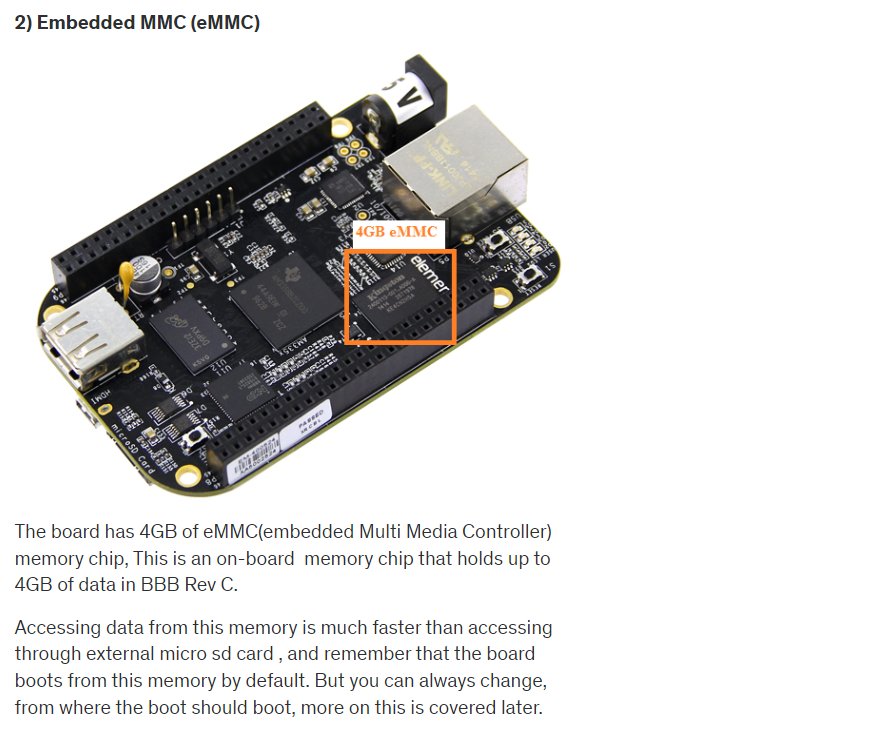

## Embedded linux development with Beaglebone black    
   
Official website for [Beaglebone black](https://www.beagleboard.org/boards/beaglebone-black).  
    
[Design](https://git.beagleboard.org/beagleboard/beaglebone-black) contain Beaglebone black **Schematic** and **Reference Manual** in Docs folder of this repository.  

Go to [wiki](https://elinux.org/Main_Page) and find your board BeagleBone Black for ton of information)  
    

## Introduction (just enough to get started):

It is actually redundant to explain about Beaglebone hardware, when you can get all the info regarding this board from its official site here     
   
The community describes this board as follows

“Beaglebone Black is a low-cost, community-supported development platform for developers and hobbyists. Boot Linux in under 10 seconds and get started on development in less than 5 minutes with just a single USB cable.”

So, you should pay attention to these points     
    
## 1. It’s an open source h/w, s/w platform.
That means, if you are planning to design your own single board computer (a SBC), then you can reuse the Beaglebone black’s design, schematics, software, etc. So, the beaglebone hardware enables you to quickly come up with your own customized board. Most of the companies ,what they do is , they take the BBB hardware design, like part numbers, schematics , BOM etc and they add customer specific add-ons or features then release the product to the market.   
   
When the hardware team is working on the new hardware, the software team will not sit idle, they test their software, drivers, and applications on reference ( such as Beaglebone ) board, which greatly reduces the time to market effort.  
   
## 2. A low cost Single Board Computer (SBC)   
   
The BBB hardware is powerful yet low cost SBC currently available.   
   
So, what’s a SBC?   
   
When a single piece of circuit board, comprises most of the personal Computer hardware/software components, then it is called as a SBC. Of course you cannot have terra bytes of hard disk mounted on a circuit board, but it has significant amount of on board memory, it has wireless/wired connectivity, it has USB interfaces, it can run operating systems, you can connect to monitor or projector. Yes! You can compare this with the motherboard of your PC.  
   
Hence it is called as single board computer. Another most famous SBC is Raspberry PI but it is partially an “open hardware” because the SOC manufacturer hides the details.    
   
   
   
    
    
    
    
    
    
     
  
    
   
   
    
## Connecting BBB and USB to serial TTL convertor hardware or cable    
   
 As I mentioned in the previous document, you can use either a standalone USB to serial TTL convertor hardware like shown below (you should arrange for the connecting jumper wires though)   
   
   
Or, you may use the USB to serial TTL converter with cable like below. This is more convenient because it has good length and you need not to bother about connecting to BBB using jumper wires.

This cable has embedded “USB to serial “converter chip inside.  
   
   
   
And always remember when you connect  “USB to Serial Convertor” to any hardware like BBB, the TX pin of this module should go to the RX pin of the another board, in this case BBB. Take look in to the table below for connection details. It’s very simple.   
   
   
   
Here is a BBB schematic details of J1 UART0 pins   
    
   
   
## Serial port monitoring software   
    
   
   
**Using Minicom**   
   
Confirm by running `sudo minicom` command in terminal to see if `Minicom` already installed  
    
OR   
   
Install on Ubuntu by first running `sudo apt-get update` and then `sudo apt-get install minicom`   
   

## Configure minicom on first time install    
   
Just connect your USB to UART convertor hardware to the PC (not beaglebone hardware.)  
   
Run the `dmesg` on terminal   
     
   
      
> Chipset converter `pl2303` is detected and attached to ttyUSB0. Alternatively, if you are using FTDI, then following output will be shown in terminal as shown below    
   
    
   
Type `sudo minicom -s` to configure the minicom and configure `Serial port setup` by choosing  
    
   
   
Keep the **Hardware Flow Control** and **Software Flow Control** as **No** as according to BBB Schematic, it doesn't have this feature available on the board   
    
   
   
Finally `Save setup as dfl` so we don't have to setup the configuration again and again.  

## BBB getting started   
   
Let us do some experiment with our new Beaglebone black Revision C hardware. Remember, the Beaglebone hardware comes with the Debian flavor of the Linux operating system which is stored in the EMMC memory of your Beaglebone hardware. when you give power (USB mini A connector over P4) to the Beaglebone hardware, it boots the pre-built or pre-loaded Debian Linux distribution from this board. A drive FAT based file system `BeagleBone Getting Started` will appear upon successful booting of a board, They have divided the EMMC memeory to different partitions like FAT and ext3 etc. and they have stored the images over there. You will find a page `START.htm` inside the Drive which contains Getting started documentation with Beaglebone hardware. Inside `Drivers/Windows/` you will see driver `BONE_D64.exe` which enables the Beaglebone's internet over USB capability. Hence you need not to connect the Ethernet cable as Beaglebone supports the Ethernet over the USB interface.   
    
> [!NOTE]   
> If some reason you failed to install the driver then you have to disable `Driver signature enforcement` on windows pc.  
    
The installation of the driver resulted in creation of the interface in the `Network connections > Uidentified network | Remote NDIS compatible Device` , which allows BBB to communicate with PC over USB cable (Ethernet over USB)    
    
## BBB Web Interface    
    
The BBB Debian OS running on the board already running a web server which you can connect to by typing the IP address `http://192.168.7.2` for Windows (You can look for the right IP address on `START.htm` according to your OS as shown below)  

      

    

   
    

      
    

   

  
   

   

  
   

   
  
   
    
   
   
    
  
 

