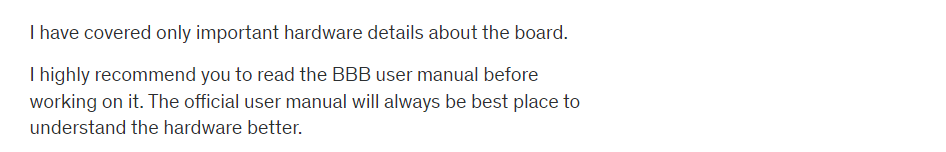

## Embedded linux development with Beaglebone black    
   
Official website for [Beaglebone black](https://www.beagleboard.org/boards/beaglebone-black).  
    
[Design](https://git.beagleboard.org/beagleboard/beaglebone-black) contain Beaglebone black **Schematic** and **Reference Manual** in Docs folder of this repository.  

Go to [wiki](https://elinux.org/Main_Page) and find your board BeagleBone Black for ton of information)  
    

## Introduction (just enough to get started):

It is actually redundant to explain about Beaglebone hardware, when you can get all the info regarding this board from its official site here     
   
The community describes this board as follows

“Beaglebone Black is a low-cost, community-supported development platform for developers and hobbyists. Boot Linux in under 10 seconds and get started on development in less than 5 minutes with just a single USB cable.”

So, you should pay attention to these points     
    
## 1. It’s an open source h/w, s/w platform.
That means, if you are planning to design your own single board computer (a SBC), then you can reuse the Beaglebone black’s design, schematics, software, etc. So, the beaglebone hardware enables you to quickly come up with your own customized board. Most of the companies ,what they do is , they take the BBB hardware design, like part numbers, schematics , BOM etc and they add customer specific add-ons or features then release the product to the market.   
   
When the hardware team is working on the new hardware, the software team will not sit idle, they test their software, drivers, and applications on reference ( such as Beaglebone ) board, which greatly reduces the time to market effort.  
   
## 2. A low cost Single Board Computer (SBC)   
   
The BBB hardware is powerful yet low cost SBC currently available.   
   
So, what’s a SBC?   
   
When a single piece of circuit board, comprises most of the personal Computer hardware/software components, then it is called as a SBC. Of course you cannot have terra bytes of hard disk mounted on a circuit board, but it has significant amount of on board memory, it has wireless/wired connectivity, it has USB interfaces, it can run operating systems, you can connect to monitor or projector. Yes! You can compare this with the motherboard of your PC.  
   
Hence it is called as single board computer. Another most famous SBC is Raspberry PI but it is partially an “open hardware” because the SOC manufacturer hides the details.    
   
   
   
    
    
    
    
    
    
     
  
    
   
   
    
## Connecting BBB and USB to serial TTL convertor hardware or cable    
   
 As I mentioned in the previous document, you can use either a standalone USB to serial TTL convertor hardware like shown below (you should arrange for the connecting jumper wires though)   
   
   
Or, you may use the USB to serial TTL converter with cable like below. This is more convenient because it has good length and you need not to bother about connecting to BBB using jumper wires.

This cable has embedded “USB to serial “converter chip inside.  
   
   
   
And always remember when you connect  “USB to Serial Convertor” to any hardware like BBB, the TX pin of this module should go to the RX pin of the another board, in this case BBB. Take look in to the table below for connection details. It’s very simple.   
   
   
   
Here is a BBB schematic details of J1 UART0 pins   
    
   
   
## Serial port monitoring software   
    
   
   
**Using Minicom**   
   
Confirm by running `sudo minicom` command in terminal to see if `Minicom` already installed  
    
OR   
   
Install on Ubuntu by first running `sudo apt-get update` and then `sudo apt-get install minicom`   
   

## Configure minicom on first time install    
   
Just connect your USB to UART convertor hardware to the PC (not beaglebone hardware.)  
   
Run the `dmesg` on terminal   
     
   
      
> Chipset converter `pl2303` is detected and attached to ttyUSB0. Alternatively, if you are using FTDI, then following output will be shown in terminal as shown below    
   
    
   
Type `sudo minicom -s` to configure the minicom and configure `Serial port setup` by choosing  
    
   
   
Keep the **Hardware Flow Control** and **Software Flow Control** as **No** as according to BBB Schematic, it doesn't have this feature available on the board   
    
   
   
Finally `Save setup as dfl` so we don't have to setup the configuration again and again.  

## BBB getting started   
   
Let us do some experiment with our new Beaglebone black Revision C hardware. Remember, the Beaglebone hardware comes with the Debian flavor of the Linux operating system which is stored in the EMMC memory of your Beaglebone hardware. when you give power (USB mini B connector over P4) to the Beaglebone hardware, it boots the pre-built or pre-loaded Debian Linux distribution from this board. A drive FAT based file system `BeagleBone Getting Started` will appear upon successful booting of a board, They have divided the EMMC memeory to different partitions like FAT and ext3 etc. and they have stored the images over there. You will find a page `START.htm` inside the Drive which contains Getting started documentation with Beaglebone hardware. Inside `Drivers/Windows/` you will see driver `BONE_D64.exe` which enables the Beaglebone's internet over USB capability. Hence you need not to connect the Ethernet cable as Beaglebone supports the Ethernet over the USB interface.   
    
> [!NOTE]   
> If some reason you failed to install the driver then you have to disable `Driver signature enforcement` on windows pc.  
    
The installation of the driver resulted in creation of the interface in the `Network connections > Uidentified network | Remote NDIS compatible Device` , which allows BBB to communicate with PC over USB cable (Ethernet over USB)    
    
## BBB Web Interface    
    
The BBB Debian OS running on the board already running a web server which you can connect to by typing the IP address `http://192.168.7.2` for Windows (You can look for the right IP address on `START.htm` according to your OS as shown below)  

      

 ## Communicating with BBB    

We will use **minicom** to talk to FTDI USART-TTL and **SSH** to connect to BBB (over internet to USB). We will accomplish both `minicom` and `ssh` from two different terminals inside Ubuntu. 

Initially FTDI may not show up on Ubuntu (when we run `dmesg`) as it is owned by Windows OS however we will go to Virtualbox and select `Devices > USB > FTDI` to change its ownership to Ubuntu. Now, it will appear (i.e. ttyUSB0) inside Ubuntu. There we will go to `Serial port setup` and rest follow the section `Configure minicom on first time install` as explained previously. Now reset your board and you will get the logs on Ubuntu's minicom.   

Let's login now in the Serial window of minicom with debain username `debian` and default password as `temppwd`. Now, check the `ifconfig`. You will find two interfaces `usb0` **192.168.7.2** (internet over usb, as beaglebone is connected with laptop over P4 through USB mini B, we will also use it to connect over ssh on seperate terminal) and `usb1` **192.168.6.2**  communicating over USB-TTL FTDI with minicom.     

On second terminal run `ping 192.168.7.2` to confirm that communication with beaglebone hardware is working over USB mini B at P4 (Internet over USB). You can now ssh beaglebone with `ssh -l debian 192.168.7.2` 
    
> [!NOTE]    
> Use the Virtual machine only when you want to compile the kernel, bootloader, or use the build root software i.e. busy box. However if you only want to write application for the beaglebone then just use the **eclipse** which is installed on your primary operating system such Windows, Mac etc. **You don't need to install Eclipse on the virtual machine for application development purpose**

## Updating the eMMC memory with the latest debian OS image and BBB Network configurations.   
   
We will flash eMMC of the Beaglebone board and then boot the Beagleboard using the eMMC memory (Revision C, onboard 4GB of eMMC memory) and the board already comes with pre-stored Debian OS, However we will reflash the Debian OS present on the eMMC memory of the board (for learning purposes and understand the working).    
    
The **eMMC** memory is actually connected to the **mmc1** interface and the **micro SD card** connector is connected to the **mmc0** interface of the AM335x SOC, And we also have 512 MB of **DDR** memory connected to the DDR interface of the SOC. 

  
    
      
> [!NOTE]
> Remember, the board always tries to boot from the mmc1 interface first by default (eMMC Memory) when you power up the board. **However, we will take the help of Micro SD card to flash the eMMC memory** (flashing the bootable images and root file system onto the eMMC memory).   
    
1. Download the latest [Debian OS image](https://www.beagleboard.org/distros) (i.e. am335x-debian-11.7-iot-armhf-2023-09-02-4gb.img.xz). You can use `xz-utils` to extract `$ unxz am335x--.img.xz`      
    
2. Write that bootable image to the SD card using disk writing software [etcher](www.balena.io/etcher) by downloading the software on ubuntu. If it doesn't run by `$ ./balenaEtcher-1.18.11.AppImage` then make it executable by chmod +x. You might as well install `apt-get install fuse` if this package is missing.   
    
3. Insert the SD card into the beaglebone and then make beaglebone boot from the SD card (Power down BBB by long press of Power button, insert the SD card, keep pressing the S2 button while pressing the Power button gently and release the S2 button shortly, and you will see the LEDs of BBB blink linearly, probably take 5-10 mins).     
   
4. Execute the eMMC flasher script by logging into BBB via SSH `$ ssh -l debian 192.168.6.2` (used to be at `/opt/scripts/tools/eMMC` with the name `init-eMMC-flasher-v3.sh` but now you can simply run `sudo enable-beagle-flasher` to flash all the contents of the SD Card on to the eMMC memory) and finally reboot `sudo reboot` and BBB LEDs will blink linearly for awhile when it stopped then you can safely remove the SD Card.   
     
      
> [!NOTE]    
> If your board already running latest version of debian OS image, then you NEED NOT to try this.   
> Check your BBB debian OS version `$ lsb_release -da` and compare the output with debian latest release. (You have to log into BBB by `minicom` if you aren't able to find the right `/dev/<PORT>` then use `$ dmesg` command)

To configure BBB Network connection over USB, follow the Networking [guide](Docs/Networking.pdf) 
   
As disscussed in the Networking guide following commands has to be saved in the **BBB** and **Host** machine.   

    

    

## BBB Linux booting process                    

Let's explore, How to boot the Linux kernel on the ARM based hardware such as Beaglebone Black target hardware which is powered by the SOC AM335x (ARM cortex A8 processor) from Texas Instruments.    
      
To run Linux on this embedded board, we need minimum of 4 software components as shown below.     
      
   
    
**RBL (ROM Boot Loader)**     
    
A very tiny boot loader with limited functionalities runs out of the ROM memory of the SOC when you power up the board. This boot loader is written by the vendor, in our case, written by the Texas Instruments, and stored in the ROM of the SOC during taping out of the chip. You cannot change this boot loader (cannot overwrite). You may also not get the source code of this boot loader. Primary job of the RBL is to load and execute the second stage boot loader **SPL/MLO** from the internal memory (_SRAM_) of the SOC.    
     
**SPL/MLO (Secondary Program Loader / Memory Loader)**   
     
The job of the Secondary stage boot loader is to load and execute the Third stage boot loader **U-boot** from the DDR memory of the board. 
    
**U-boot**      
    
The job of the Third stage boot loader is to load and execute the Linux kernel from the DDR memory of the board. Hence the booting actually takes place in 3 stages.

_And to complete the successful boot of the **Linux kernal**, we also need a root file system **RFS**_ 
     
      
## BeagleBone Board Boot options    
     
you can boot the AM335x SOC from the following boot sources    
      
1. NAND Flash    
2. NOR Flash (eXecute In place, XIP)    
3. USB    
4. eMMC    
5. SD card   
6. Ethernet    
7. UART   
8. SPI          
    
_Page number 4106 of the [TRM](Docs/TRM_AM335x_techincal_reference_manual.pdf) , you will find the below table._    
     
   
    
Take a look at _SYSBOOT[4:0]_ `SYSBOOT` is one of the register of this SOC and its first five bits decide the boot order .   
   
For example,   
When SYSBOOT [4:0] = 00000b (This is reserved, you cannot use this configuration)
When SYSBOOT [4:0] = 00001b then **1st** SOC will try to boot from UART0, if fails, **2nd** it tries to boot from XIP (XIP stands for eXutable In Place memory like NOR Flash), if that also fails, **3rd** it will try to boot from MMC0, if no success, **4th** it tries to boot from SPI0, if that also fails, then SOC outputs the error message and stops.  

## How SOC decides the boot order?    

When you reset the SOC, the code stored in the ROM of the SOC runs first !    
     
   
    
The code stored in the “ROM” is called **ROM boot loader**, this is programmed in to the ROM of the SOC during taping out of the chip, you cannot change it as it is in the ROM Read only.

The job of the ROM is to set up the SOC clock, watch dog timer, etc and load the second stage boot loader (MLO or SPL). By reading the register SYSBOOT [15:0], and based on the value of SYSBOOT[4:0] it prepares the list of booting devices. The register SYSBOOT [15:0] value is decided by the voltage level on the SYSBOOT pins.

Hence, if SYSBOOT[4:0] = 00011b, then boot order will be , UART0, SPI0, XIP, MMC0 (as shown in the above table). Therefore, we can say that, The SYSBOOT pins configure the boot device order (set by SYSBOOT[4:0]). Some board, will give you the control to change the SYSBOOT[15:0] value by using dip switches like below.      
     
   
    
However, in the BBB, there are no such dip switches to configure the SYSBOOT pins. BBB has some other circuitry to decide the SYSBOOT pins voltage level, read on!!    
    
## BBB Boot order configuration circuit   
   
In BBB you will find this circuitry, (In the [SRM](BBB_SRM.pdf))    
     
   
     
Here observe that SYS_BOOT2 is connected to a button S2 (Boot button) of the BBB.

When you simply give power to the board, You will find the voltage level as below.

SYS_BOOT0 = 0V

SYS_BOOT1 = 0V

SYS_BOOT2 =1V

SYS_BOOT3 = 1V

SYS_BOOT4 = 1V

You can confirm this by measuring the voltage level using Mutlimeter (voltage of 45, 44, 43,41, 40 pins of the expansion header P8 of the board as SYSBOOT[4:0] = 11100)   
     
   
     
And when you press the S2 button, SYS_BOOT2 will be grounded , so SYSBOOT[4:0]= 11000     
      
Now based on S2 (BBB boot button) we got 2 boot configurations:

1. S2 released (SYSBOOT[4:0] = 11100)

The boot order will be

MMC1 (eMMC)
MMC0 (SD card)
UART0
USB0

2. S2 pressed (SYSBOOT[4:0] = 11000) , The boot order will be

SPI0
MMC0 (SD card)
USB0
UART0

So, to conclude, there are 5 boot sources supported for this board including SPI.    
     
1) eMMC Boot(MMC1) :

 eMMC is connected over MMC1 interface, This is the fastest boot mode possible, eMMC is right there on your board, so need not to purchase any external components or memory chip. This is the default boot mode. As soon as you reset the board, the board start booting from loading the images stored in the eMMC.   
 
 If no proper boot image is found in the eMMC, then Processor will automatically try to boot from the next device on the list. 

2) SD Boot :

 If the default ( that is booting from eMMC) boot mode fails, then it will try to boot from the SD card you connected to the sd card connector at MMC0 interface. 
 
 If you press S2 and then apply the power, then the board will try to boot from the SPI first, and if nothing is connected to SPI, it will try to boot from the MMC0 where our SD card is found

Also remember that we can use SD card boot to flash boot images on the eMMC. So if you want to write new images on the eMMC  then you can boot through sd card, then write new images to eMMC, then reset the board, so that your board can boot using new images stored in the eMMC.  We will do these experiments later in this course. Don’t worry!

3) Serial boot :   

In this mode, the ROM code of the SOC will try to download the boot images from the serial port.

We have separate experiment on this boot mode and its very interesting. 

4 ) USB BOOT :   

You may be familiar with this boot mode, that is booting through usb stick!   

You would have booted your PC through the usb stick. What you do is, you restart the PC, then press bios button to put the PC in to bios mode, there you select boot form usb, right  

It is very similar, when you reset the board, you can make your board to boot from the USB stick. 

## More details about ROM Code Booting procedure!

These are the 2 flow charts, you can find in the [TRM](Docs/TRM_AM335x_techincal_reference_manual.pdf) **page 4103** of the am335x SOC    
     
   
         
Here, you can see that the ROM code goes through its boot device list to load the Second stage boot loader (SPL/MLO). **It will prepare the boot devices list based on the value of SYSBOOT pins**. 

## The ROM Code start-up procedure    
    
(page 4102)       
     
   
         

   

    
     

   
    

      
    

   

  
   

   

  
   

   
  
   
    
   
   
    
  
 

